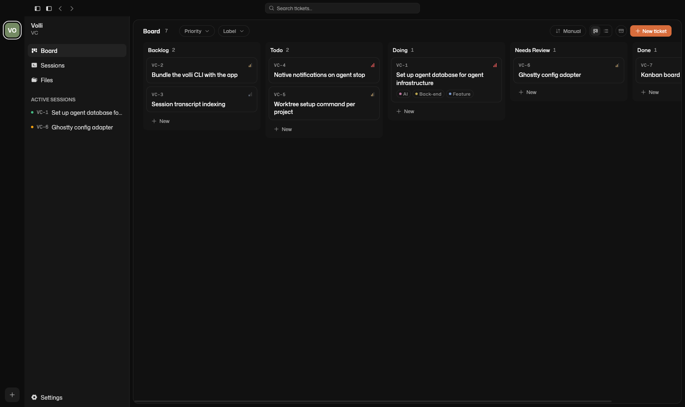

# Volli Code

**Where tickets become terminal workspaces.**

Volli Code brings kanban planning and coding agents into one local-first macOS app. Each ticket carries the brief, branch, worktree, terminal sessions, and history of the work.

> [!NOTE]
> Volli Code is under active development. The tracker, SQLite persistence, ticket detail, and embedded terminal are working; the automatic ticket → worktree → agent lifecycle is being built now.



## One loop from plan to pull request

Most agent workflows split context between a tracker and a pile of terminals. The tracker does not know what the agents are doing, and the terminal does not know what the plan is.

Volli Code is built around a simpler loop:

1. Write the ticket — its description and attachments become the agent's brief.
2. Move it to **Doing** — Volli creates an isolated worktree and starts the coding agent you choose.
3. Follow the board — agent activity moves the ticket between **Doing** and **Needs Review**.
4. Review and ship — the branch, terminal history, and pull request stay attached to the ticket.

## Built for agent-driven work

### The ticket is the workspace

Planning and execution live together. Open a ticket to see its specification, live terminal sessions, comments, and full activity history.

### The board reflects reality

Volli's fixed workflow — **Backlog**, **Todo**, **Doing**, **Needs Review**, and **Done** — shows whose turn it is. Native notifications bring you back when an agent needs attention.

### Parallel work stays isolated

Each ticket gets its own git worktree and `volli/<ticket>-<slug>` branch by default, so multiple agents can work across projects without colliding.

### Local-first by design

Projects, tickets, preferences, and the event log live in SQLite on your Mac. Session transcripts stay as indexed local files. No account or cloud service is required.

Volli Code is designed for Claude Code, Codex, OpenCode, and other CLI coding agents.

## Why Volli Code?

Coding agents now do long stretches of real engineering work, but the tools around them still treat planning and execution as separate jobs. That leaves the human syncing tickets, branches, terminal sessions, and review state by hand.

Volli Code makes the ticket the durable unit of work. The board organizes the plan, the terminal executes it, and the event history records what happened — all in one place.

## Development

Volli Code currently targets macOS and requires Node `^24.13` and pnpm 11.

```bash
pnpm install
pnpm dev
```

Build and run the production bundle locally:

```bash
pnpm run build
pnpm start
```

Run the quality checks:

```bash
vp run -r typecheck
vp run -r test
vp check
```

Read the [product concept and decision log](docs/CONCEPT.md) for the full vision, or the [Swift reference](docs/SWIFT-REFERENCE.md) for the original app's parity target.

Volli Code is an Electron, React, and TypeScript rewrite of the native Swift original.
