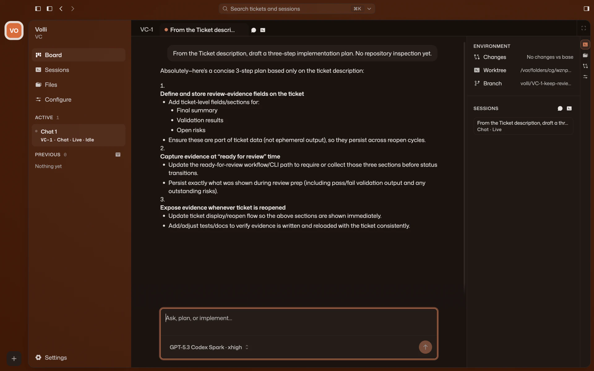

<p align="center">
  
</p>

<h1 align="center">Volli Code</h1>

<p align="center">
  A local-first macOS workspace for planning coding work and running it through durable, Pi-backed Sessions.
</p>

<p align="center">
  <a href="https://volli.app">Website</a>
  ·
  <a href="https://docs.volli.app">Documentation</a>
  ·
  <a href="https://docs.volli.app/start/install/">Build from source</a>
</p>

<a href="https://volli.app">
  
</a>

## From Ticket to review

`Ticket → Session → worktree → Change Set → review`

- Plan scope, constraints, and the review target on a local Ticket board.
- Run durable Pi-backed Ticket Sessions in isolated Git worktrees, or project Sessions from the main checkout.
- Inspect the live Change Set beside the Session history that produced it.
- Open Claude Code, Codex, OpenCode, or a custom TUI in an embedded terminal when you want a manual companion.

App state, Tickets, and Session history stay on your machine. Model requests go to the provider you select through Model Access.

## Build from source

> [!NOTE]
> Volli is in active development and does not have a packaged release yet.

Requirements: macOS, Node.js `^24.13.0` (a `.nvmrc` is provided — `nvm use`), and pnpm `11.10.0`. The Node range is enforced: `pnpm install` and the dev scripts refuse to run under an unsupported Node, because native modules built against the wrong ABI leave the app unable to open its database (and sign-in disabled).

```bash
git clone https://github.com/hussainph/volli-code.git
cd volli-code
pnpm install
pnpm dev
```

To build and run the production bundle locally:

```bash
pnpm run build
pnpm start
```

See the [installation guide](https://docs.volli.app/start/install/) for native dependency setup and troubleshooting.

## Automation is in development

Automations will save a Trigger, Instructions, and Outcome for recurring Ticket work. Each Run will start one Pi-backed Session and record its result with the Ticket. Automations are not available today.

## Project

- [Documentation](https://docs.volli.app)
- [Contributing](CONTRIBUTING.md)
- [Security policy](SECURITY.md)
- [Apache-2.0 license](LICENSE)
