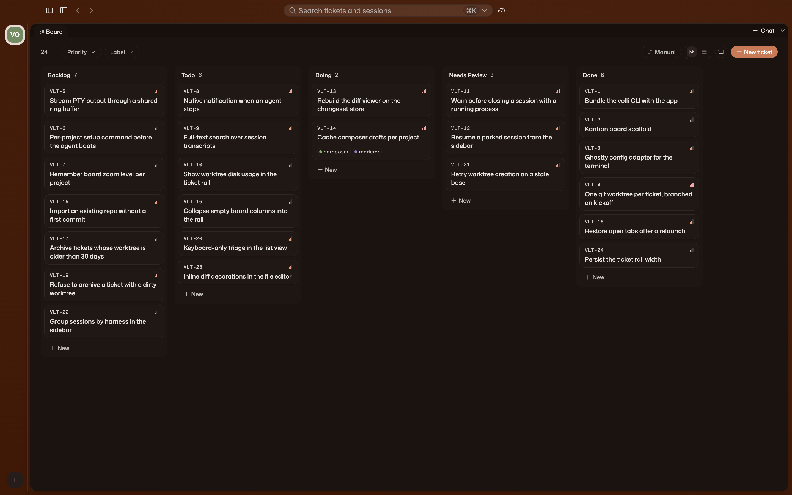

<p align="center">
  
</p>

<h1 align="center">Volli Code</h1>

<p align="center">
  A local-first macOS workspace for parallel coding agents. Turn rough ideas into focused tasks yourself or with an agent, run them in parallel, and review every change in one place.
</p>

<p align="center">
  <a href="https://volli.app/download/">Download</a>
  ·
  <a href="https://volli.app">Website</a>
  ·
  <a href="https://docs.volli.app">Documentation</a>
  ·
  <a href="https://github.com/hussainph/volli-code/issues">Feedback</a>
</p>

<p align="center">
  
</p>

## Install

> [!IMPORTANT]
> Volli Code is in **early alpha**, for **Apple silicon** Macs (M1 and later). Builds ship as prereleases, features move between them, and behavior you rely on can change. There is no Intel or universal build yet.

Download the current build from [volli.app/download](https://volli.app/download/), or from [GitHub Releases](https://github.com/hussainph/volli-code/releases) if you want a specific one. Builds are signed with a Developer ID and notarized, and the app updates itself from the same feed when you quit.

The [installation guide](https://docs.volli.app/start/install/) covers first run, where your data lives, and how to uninstall cleanly.

## From idea to reviewed code

`idea → tasks → agent chats → branches → review`

In Volli, a task is a ticket.

- Turn a rough idea into focused tasks yourself, or ask an agent to help break the work down.
- Start an agent chat for each task. Each ticket gets its own context and isolated Git worktree, so independent work stays separate.
- Return to a task's chat, branch, files, and changes when it is ready. Read the change before you move it forward.
- Open Claude Code, Codex, OpenCode, or a custom TUI in an embedded terminal when you want to drive it yourself.

Projects, tickets, and chat history stay on your machine. Model requests go to the provider you select through Model Access.

## Build from source

Requirements: macOS, Node.js `^24.13.0` (a `.nvmrc` is provided — `nvm use`), and pnpm `11.10.0`. The Node range is enforced: `pnpm install` and the dev scripts refuse to run under an unsupported Node, because native modules built against the wrong ABI leave the app unable to open its database (and sign-in disabled).

```bash
git clone https://github.com/hussainph/volli-code.git
cd volli-code
pnpm install
pnpm dev
```

To build and run the production bundle locally:

```bash
pnpm run build
pnpm start
```

See the [installation guide](https://docs.volli.app/start/install/) for native dependency setup and troubleshooting.

## Project

- [Documentation](https://docs.volli.app) · [Quickstart](https://docs.volli.app/start/quickstart/)
- [Releases](https://github.com/hussainph/volli-code/releases)
- [Report a bug or give feedback](https://github.com/hussainph/volli-code/issues)
- [Contributing](CONTRIBUTING.md)
- [Security policy](SECURITY.md)
- [Apache-2.0 license](LICENSE)
