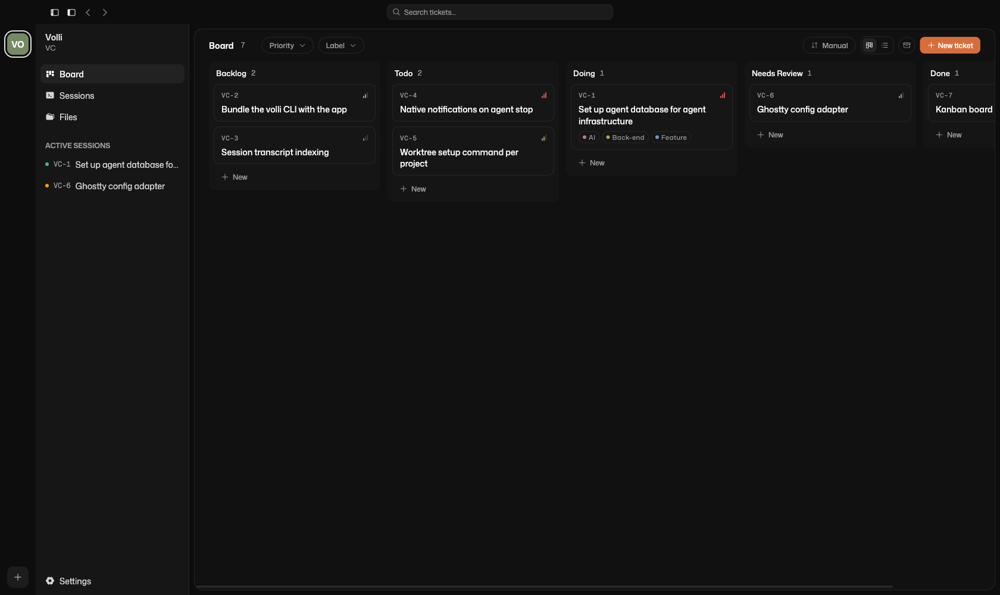

# Volli Code

Volli Code is a local-first macOS workspace for planning and running coding work. It keeps Tickets,
durable agent Sessions, isolated Git worktrees, Change Sets, review, and terminal companions in one
app. App state and Session history are stored on your machine; model requests go to the provider you
select through Model Access.



## What you can do

- Organize work as Tickets on a local board.
- Start durable Ticket Sessions in the ticket's isolated worktree, or project Sessions in the main checkout. Volli's structured Sessions use its Pi-backed Agent Runtime.
- Inspect the ticket's Change Set and prepare work for review without losing the context that produced it.
- Open embedded terminals for manual work with Claude Code, Codex, OpenCode, or a custom TUI harness.

## Build from source

There is no packaged release yet. To try Volli Code, build it from source on macOS.

Requirements: Node.js `^24.13.0` and pnpm `11.10.0`.

```bash
git clone https://github.com/hussainph/volli-code.git
cd volli-code
pnpm install
pnpm dev
```

To build and run the production bundle locally:

```bash
pnpm run build
pnpm start
```

Useful checks:

```bash
pnpm run typecheck
pnpm test
pnpm run check
```

## In development

### Automation

Automation is actively in development and is not available today. An Automation will be a saved way to start work on a Ticket with a Trigger, Instructions, Runtime, and Outcome. Each invocation will create a Run that owns one Session; its declared Outcome will describe what happens to the Ticket when the Run ends.

## Learn more

- [Volli](https://volli.app)
- [Documentation](https://docs.volli.app)
- [Contributing](CONTRIBUTING.md)
- [Security policy](SECURITY.md)
- [Apache-2.0 license](LICENSE)
