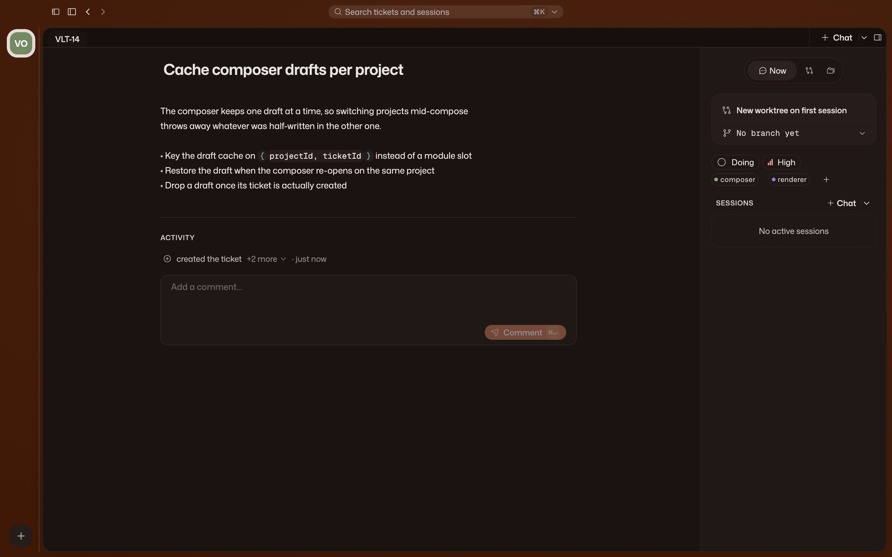

import { Aside, CardGrid, LinkCard, Steps } from "@astrojs/starlight/components";

By the end of this tutorial, you will turn a rough idea into focused tasks, run
an agent on one task, and inspect the change before you deliver it.

In Volli, a task is a **ticket**. You need Volli [installed](/start/install/), a
git repository on disk, and about fifteen minutes.

## Add a project

In the project rail, select **+**, then choose a git repository. That folder
becomes the project's main checkout. Volli derives a ticket prefix from the
folder name. A folder called `harbor` gets tickets such as `HB-1` and `HB-2`.

The project opens on **Home**, a tabbed workspace. Its permanent **Board** tab
organizes tasks. Project chats and files open as tabs beside it.

## Turn an idea into tasks

<Steps>

1. **On Home, select Chat.**

   This starts a *project chat* in your main checkout.

2. **Describe the goal in broad terms.**

   Use a project chat when you want help shaping the work:

   > We need to move billing off the nightly job and onto Stripe webhooks. Break
   > this into tasks for me.

3. **Return to Board.**

   A project chat can create and edit tickets. Review the tasks it created and
   adjust them before you start work.

</Steps>

A project chat sees your main checkout and the whole board. Use it when the
work is not shaped yet. A ticket chat works on one task in that task's isolated
checkout.

## Write a task brief

On the Board, open a task. It opens a ticket workspace.

The first tab is its **Ticket Body**. Write what must change, what must not
change, and how you will judge the result. This brief is the starting context
for every chat on the ticket.

## Run a task

<Steps>

1. **Inside the ticket, select Chat.**

   Volli prepares the ticket's isolated git worktree and starts a chat with the
   ticket body and resolved context.

2. **Answer questions as the agent works.**

   When the agent needs a decision, it asks. You can interrupt it at any time.

3. **Return to the chat later.**

   Close the tab or quit the app. Reopen the chat from the ticket's **Chats**
   rail, the sidebar, or <kbd>⌘K</kbd>. Its history remains available.

</Steps>

For independent tasks, repeat this process from each ticket. Each task uses its
own worktree and branch, so their changes stay separate while agents work in
parallel.

<Aside type="note" title="Moving a ticket does not start work">
  Moving a ticket to **Doing** organizes the board. Start work by selecting
  **Chat** inside the ticket.
</Aside>

## Review the change

The task worked in its own git worktree and branch, separate from your main
checkout.

- **Changes** shows the change set against the base branch.
- **Files** opens the task's files as they are in the worktree.

Read the change yourself. Volli shows you what happened, but it does not certify
that the work is correct or run your tests for you.

## Deliver the task

Commit, push, and open a pull request from the ticket's repository summary.
Then move the ticket and clean up its worktree when you are done.

## Optional: Use a terminal

To drive a CLI yourself, open the caret beside **Chat** and choose **Terminal**.
You get a shell in the ticket's worktree for Claude Code, Codex, OpenCode, or
your own TUI. Volli never opens one as a fallback.

## Next steps

<CardGrid>
  <LinkCard
    title="The board"
    href="/guides/board/"
    description="Columns, priorities, filtering, and what the board controls."
  />
  <LinkCard
    title="Ticket workspace"
    href="/guides/ticket-workspace/"
    description="A task's brief, chats, files, and changes."
  />
  <LinkCard
    title="Chats and worktrees"
    href="/guides/agents-and-worktrees/"
    description="Run project and task chats while keeping their branches separate."
  />
  <LinkCard
    title="Concepts"
    href="/start/concepts/"
    description="Look up the terms Volli uses in the app."
  />
</CardGrid>
