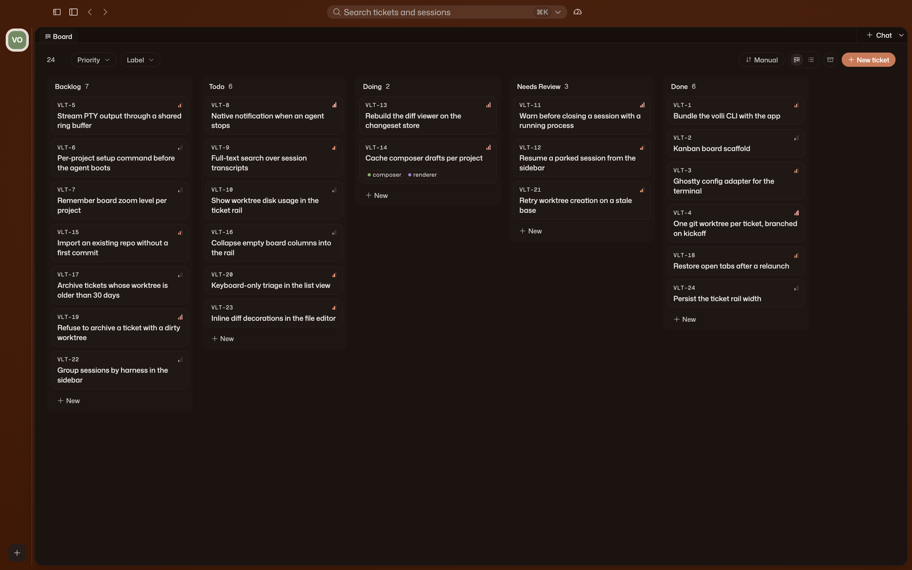

This tutorial puts an agent's change on a separate Git branch and shows you
where to review it.

You need Volli [installed](/start/install/), a Git repository on disk, and a
[default model set](/guides/models/). Pick a small task you can check, such as
fixing a mistake in your project's README.

## Add your repository

1. In the project rail, select **+** and choose your repository folder.
2. Open **Home → Board**. Each card is a **ticket**, Volli's name for a task.

The folder you added is the project's **main checkout**. A ticket chat uses a
separate checkout, called a **worktree**, by default.

## Create a ticket

1. On the Board, select **New ticket**.
2. Enter a title and a brief: what to change, and how to check the result. For a
   README fix, name the wrong text and its replacement.
3. Select **Create ticket**.
4. Open the ticket. Its **Ticket Body** holds the brief you wrote.

The ticket workspace keeps that brief, its Sessions, files, and changes together.

## Start the agent

1. In the ticket workspace, select **Chat**. This opens a draft composer.
2. Send an instruction such as: “Make the change in the ticket brief. Check
   the result and tell me which files changed.”
3. Read the agent's messages and tool results. Answer any question it asks.

Your first message creates the **Session**, the record of the conversation, and
prepares the ticket's worktree. Opening the draft starts no work.

Moving a ticket to **Doing** records its status. It starts a Run only if an
enabled Automation is armed for that column. You do not need an Automation for
this tutorial.

## Inspect the result

1. In the ticket's **Diffs** rail, open each changed file and read its diff.
2. In **Files**, open a file to see its full contents in the worktree.
3. Check the result against the brief. For code changes, run the project's
   relevant tests in a [terminal companion](/guides/terminal-companions/).

Diffs shows committed and uncommitted changes against the ticket's base branch.
Opening this view runs no tests and does not check the change for you.

To publish the result, follow
[Review and publish changes](/guides/review-changes/). It covers confirming the
commit, pushing the branch, and opening a draft pull request.

## Return to the conversation

In the ticket's **Now → Sessions** section, open the chat to return to its
history. Closing a tab does not delete the Session. See
[Use a chat](/guides/sessions/) for interruption and crash recovery.

For another independent task, create another ticket and repeat the process. Its
worktree and branch keep the changes separate.

## Optional: Plan broader work

On **Home**, select **Chat** and send your broader goal. This creates a
**Board Session** in the main checkout. Ask it to break the work into tickets,
then review their briefs before starting ticket chats.

After you have a workflow worth repeating, [create an
Automation](/guides/automations/create/) to save its starting instructions.
