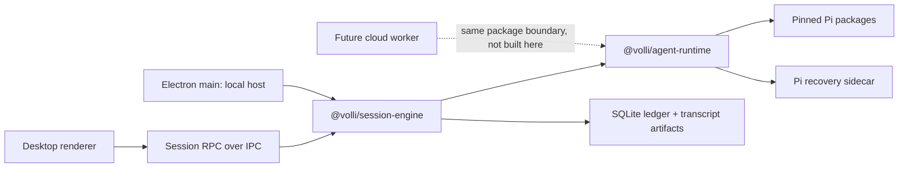

# Pi-native Ticket Session migration

**Status:** Decision complete; ready for implementation planning

**Date:** 2026-08-08

**Scope:** Local, single-player Ticket Sessions and the removal of structured OpenCode execution

## Destination

Volli has one excellent structured agent experience: a Ticket Session powered by
Pi through a product-owned `@volli/agent-runtime`. The user chooses model access,
not a harness. The Session remains durable, recoverable, worktree-scoped, and
rendered through Volli semantics. OpenCode no longer shapes the structured
runtime, transcript, composer, settings, or lifecycle.

This is a migration specification, not an instruction to preserve the current
implementation. Every existing subsystem must earn its place. Implementation
sessions may preserve, simplify, replace, or delete code according to the rubric
below; an unclear call is brought back to the product owner before building.

## Product decision

Volli is an opinionated agentic SDLC product, not a multi-harness client.

- The local single-player product stays free, open source, and local-first.
- Users bring model access through supported subscriptions, API keys, gateways,
  or local inference. Volli does not promise that every provider exposes every
  commercial entitlement.
- Pi is the acknowledged open-source substrate for the one structured Agent
  Runtime. Pi is not a user-selectable mode and its vocabulary is not Volli's
  product contract.
- External coding harnesses may still run manually in persistent terminal tabs.
  They are companion tools, not structured Session fallbacks; Volli promises no
  transcript ingestion, feature parity, native continuation, or semantic control
  for them.
- Harness feature parity is not a goal. Volli adopts useful jobs and gives them
  a Volli-native expression. Plans, Subagents, MCP, slash commands, and
  Automations are product decisions, not upstream checklists.
- The product sequence is Ticket Sessions, then Project Sessions, then reusable
  Automations. Later work may add durable Subagent Sessions, native MCP/plugin
  surfaces, mobile supervision, cloud execution, and multiplayer.

## Why this migration exists

The durable Session core is substantially more neutral than the product edge:

- Session intent is persisted before delivery and receipts make delivery
  observable in `packages/session-engine/src/session-runtime.ts`.
- Settled transcript artifacts are durable while stream deltas remain transient.
- Session RPC, IPC, renderer subscriptions, drafts, worktree preparation, and
  Change Sets are already useful product foundations.

The current structured edge is nevertheless an OpenCode product integration:

- Electron constructs and registers one native producer, OpenCode, in
  `apps/desktop/src/main/index.ts`.
- The runtime selects producers through `adapterId` and `profileId` and probes a
  generic Runtime Catalog.
- the renderer defaults to OpenCode and exposes provider models, variants, and
  OpenCode-shaped agent modes in `renderer/src/chat/client.ts` and
  `renderer/src/chat/session-model.ts`.
- the transcript derives plans from a fabricated `todowrite` tool shape and the
  Session rail gives Plan/Subagent concepts permanent chrome.
- tests prove one real producer. Generic fake adapters establish ledger and
  transport behavior, not a product need for adapter plurality.

Continuing the multi-harness path would make provider translation, capability
parity, and upstream drift a permanent product cost. Owning one loop moves that
effort into prompt design, tools, permissions, orchestration, recovery, and
workflow quality that compounds into Volli itself.

## Scope

This effort delivers:

1. A host-independent, product-aware `@volli/agent-runtime` package backed by an
   exact pinned Pi revision.
2. A Pi-backed Ticket Session that works in a ticket worktree, streams useful
   output, stops, settles durably, and recovers after relaunch.
3. A model-access flow backed initially by Pi-owned credentials and sanitized
   model availability.
4. A clean Ticket Session UI with no harness choice and no OpenCode-shaped Plans
   or agent modes.
5. Volli semantic activity mapped onto the existing rich inline tool UI.
6. A contextual Environment inspector and persistent terminal companion tabs.
7. Removal of structured OpenCode execution and the generic platform machinery
   that has no remaining product purpose.
8. Deliberate archival/read-only handling for old structured Sessions where it
   is cheap; no cross-runtime resume.

## Explicitly out of scope

- Project Sessions and project-level orchestration tools.
- Durable Subagent Sessions and child-worktree concurrency.
- Reusable Automations.
- Plan mode or a first-class in-chat Plan object.
- A public Pi package marketplace or arbitrary extension loading.
- Agent Plugins beyond preserving a future path for portable Skills and MCP.
- The final Volli permission model or classifier-based Auto Mode.
- Broad custom Volli tools; the first migration slice uses constrained coding
  tools and a Runtime Brief.
- Formal model/harness benchmark leadership.
- Cloud workers, remote synchronization, mobile clients, multiplayer, split
  views, or view stacking.
- A full system-prompt research programme.
- Compatibility with OpenCode's feature set or native conversation continuation.

These are follow-up efforts, not fog inside this one.

## Canonical domain

`CONTEXT.md` is authoritative. The load-bearing terms for this effort are:

- **Session:** durable product identity and ordered local history.
- **Session Role:** `project`, `ticket`, or `subagent`; only `ticket` ships here.
- **Authority Snapshot:** durable per-Session execution authority.
- **Agent Runtime:** product-aware execution package, initially built on Pi.
- **Model Access:** sanitized accounts, credentials, billing source, and model
  availability; secrets never enter renderer or Session history.
- **Session Semantic Fact:** product-owned history emitted at the runtime
  boundary; Pi-native details remain diagnostics unless deliberately adopted.
- **Session Attachment:** one historical executor binding and recovery reference.
- **Command / Receipt:** durable intent and its observed runtime-boundary outcome.

## Target architecture

### Package ownership

| Module | Owns | Must not own |
| --- | --- | --- |
| `@volli/shared` | Pure domain vocabulary, Session Roles, semantic activity, authority and model-access DTOs | Pi, Node, Electron, DOM, credentials |
| `@volli/session-engine` | Sessions, commands, receipts, ordered facts, projections, attachments, runtime coordination | Pi event parsing, renderer UI, Electron APIs |
| `@volli/agent-runtime` | Pi lifecycle, prompt assembly, model bridge, scoped coding tools, runtime sidecars, Pi-to-Volli observation mapping | SQLite, Tickets, React, Electron, product history ownership |
| `@volli/session-rpc` | Sanitized Session transport | Pi and credential details |
| Electron main | Local host, SQLite adapters, worktree paths, OS integration, IPC | Product-specific Pi semantics that belong in `agent-runtime` |
| Renderer | Session projection, draft/view state, product UI | Pi events, secrets, Node APIs, runtime recovery logic |

`@volli/agent-runtime` may depend on Node but never Electron or the DOM. A future
worker may instantiate the same package. This requirement does not authorize any
remote transport, scheduler, cloud state, or mobile code in this effort.

### Singular runtime port

The current adapter contract may be used as temporary migration scaffolding,
but the target is one private executor port, not a registry or plugin platform.
Its conceptual responsibilities are:

- start or reopen a runtime attachment from a Ticket Session specification;
- accept message submission, queue/steer where supported, interrupt, and
  interaction resolution;
- emit transient transcript deltas and durable Volli observations;
- return observable delivery outcomes;
- reconcile completed runtime entries after interruption or process loss;
- release local resources without ending Session identity.

It does not expose manifests, profiles, arbitrary adapters, provider-shaped agent
modes, or UI components. Pi-specific identities live inside a bounded runtime
reference stored on the Session Attachment.

### Audited landing constraint

The first desktop Pi slice may use a private facade around the current Session
coordinator only where that shortens delivery. That facade is a fixed internal
bridge to the sole structured runtime; it must not create a new registry,
manifest, profile, catalog, selection, or capability-parity surface. Runtime
Brief, Authority Snapshot, tool policy, delivery outcomes, and recovery
references are product-owned `agent-runtime` inputs and outputs, never extra
fields smuggled through the OpenCode-shaped `HarnessCommand`. The renderer
stops issuing `adapter.attach` when the singular runtime host lands; the host
attaches its one structured runtime automatically.

### Canonical history and recovery

Volli's ledger and transcript artifacts are canonical. Pi's JSONL/session data is
only a recovery sidecar used to rebuild model context and locate completed
entries after restart.

- A user Command commits before runtime delivery.
- A transient delta never advances the durable recovery cursor.
- A completed runtime message settles once into a content-addressed transcript
  artifact and Session Event.
- Stable Pi entry identities deduplicate replay after restart.
- A crash may lose an uncommitted streaming tail. It may not duplicate a settled
  message or silently report a completed turn that Volli never committed.
- A disagreement between the sidecar and ledger becomes explicit recovery
  Attention; it is never silently resolved in Pi's favor.

## Pi ownership and fork policy

Start from an exact Pi revision; never use a floating range.

- Record the upstream repository, commit/tag, license, included packages, and
  local patches in `packages/agent-runtime/UPSTREAM.md`.
- Prefer the smallest useful Pi layers. Do not inherit Pi TUI, CLI, package UI,
  session presentation, or extension discovery merely because they exist.
- Volli owns prompt composition, tool authority, durable Sessions, product tools,
  presentation, and application lifecycle from the first slice.
- A concrete product requirement that cannot be expressed cleanly through the
  contained Pi surface triggers a decision to fork or vendor the smallest
  relevant package.
- Each divergence records its reason, upstream base, affected directories, tests,
  and whether future upstream changes should be merged or intentionally ignored.
- General improvements may be contributed upstream, but Volli-specific progress
  never depends on upstream acceptance.

This is a fork-friendly posture, not a blind fork of the complete Pi monorepo.

## Runtime specification

### Ticket Session input

The Agent Runtime receives a product-owned specification containing:

- Session, root Thread, attachment, Project, and Ticket identities;
- `role: "ticket"`;
- immutable ticket-worktree path and execution venue;
- selected provider/model and reasoning policy;
- Authority Snapshot;
- controlled prompt resources and generated Runtime Brief;
- an explicit tool bundle;
- optional Pi recovery reference;
- cancellation signal and observation sink.

Ticket content is user context, not hidden policy. The runtime may not infer
board authority from prose inside a repository or Ticket Body.

### Prompt composition

Prompt construction is an explicit, deterministic module in
`@volli/agent-runtime`.

Initial layers are:

1. Minimal Pi operating/tool instructions required for correct execution.
2. Volli role and trust rules.
3. Authority and workspace boundaries.
4. The generated Runtime Brief as persisted Session input.
5. User messages and later tool results.

Volli composes around Pi initially rather than replacing every proven prompt
instruction before the loop works. The architectural goal is nevertheless to
adapt Pi to Volli. Prompt assembly receives deterministic snapshot tests. A
separate medium-term research effort will compare public Pi, OpenCode, Codex,
Claude, and other harness prompt practices alongside a lean live-model eval
corpus.

### Model access and credentials

Pi owns provider credentials and refresh behavior in v1.

- One side owns each credential store; Electron and Pi never race to mutate the
  same token.
- Secrets never enter SQLite Session history, transcript artifacts, IPC, React,
  logs, or prompts.
- The renderer receives sanitized provider/account labels, model availability,
  reasoning options, billing-source hints where known, and actionable failure
  states.
- There is no OpenCode-auth extraction, automatic account rotation, inference
  fallback, or arbitrary provider plugin system.
- A Volli-owned `ModelAccess` service is deferred until graphical auth, expanded
  provider coverage, or cloud credential hosting makes it necessary.
- The first authentication recovery is an explicit Pi-owned external or terminal
  handoff plus Retry. It is not a hidden fallback and it never reveals secrets.
  An in-app connect flow is a near-term follow-up: scope it immediately after
  the handoff is working, rather than treating the handoff as the final product.

### Tool boundary

The first slice loads only an explicit Volli-selected coding tool set. User,
project, and globally installed Pi extensions do not auto-load.

- All filesystem and process work is rooted in the Ticket worktree.
- Tool policy is enforced before execution, not inferred from UI presentation.
- The v1 migration does not ship classifier Auto Mode; it preserves the future
  Authority Snapshot seam.
- Product tools use a compact `volli.*` contract and the existing
  command/receipt machinery in later slices. They do not automate the renderer.
- Project, Ticket, and Subagent Roles will eventually receive different bundles.
  Final tool lists and permission rules are deferred to their own design work.

### Runtime observation vocabulary

The boundary emits Volli meaning, not Pi event objects:

- attachment started, recovered, closed, or failed;
- turn started, completed, or interrupted;
- transient text/reasoning/activity delta;
- settled transcript message;
- activity state and outcome;
- interaction opened, resolved, or withdrawn;
- Attention raised or cleared;
- sanitized usage and model identity when available.

Raw Pi detail is bounded, sanitized diagnostics. No renderer branch may dispatch
on Pi tool or event names.

## Ticket Session presentation

### Hierarchy

The central reading surface remains transcript plus composer. Optional product
state appears only while useful; empty future features do not reserve chrome.

The irreducible surface is:

- Session and Ticket identity through the existing tab/workspace hierarchy;
- transcript;
- reasoning status;
- inline activity/tool presentation;
- Attention and interaction cards;
- composer, queue/steer where supported, and Stop;
- compact model/reasoning and Authority controls;
- attachments and Runtime Brief access;
- Change Set access;
- terminal companion tabs;
- a compact contextual Environment inspector.

### Transcript and activity

Preserve the existing flat transcript, activity bundles, inline tool detail,
interaction placement, reasoning semantics, draft persistence, and resident
subscription model where they pass the preservation rubric.

Map tools into a closed Volli activity vocabulary:

- inspect/search;
- read;
- edit/create;
- execute/test;
- network;
- Volli action;
- delegated work;
- unknown activity.

Existing presenters keep filenames, commands, line counts, diffs, duration,
exit status, and result summaries. Raw tool input is diagnostic disclosure, not
the default view. Unknown tools use the same component family rather than an
unstructured JSON card.

Reasoning retains the current product semantics: lightweight while active,
collapsed or summarized after completion, with full durable content available
to diagnostics where policy permits. Do not redesign reasoning during the
runtime migration.

### Composer

- Remove harness and profile selection.
- Remove provider-specific agent modes such as Build/Plan.
- Keep the model control in the composer; provider/account and billing source
  appear in the expanded choice or recovery state, not as permanent chrome.
- Keep Stop and the existing queue/steer semantics where the runtime supports
  them. Unsupported delivery behavior returns an explicit rejection rather than
  being silently reinterpreted.
- Preserve a slash-command surface, but commands are Volli-owned or installed
  capabilities. OpenCode commands do not migrate by name.
- Ticket Sessions initially persist a durable `Auto` Authority Snapshot. Do not
  render a fake one-option authority control; expose a composer control only
  when the user can inspect or explicitly change a real policy. Detailed
  defaults and the full Auto/Manage design are later work.

### Contextual Environment inspector

Replace the permanent Plan/Subagent/Background-process Session rail with a
compact, contextual inspector inspired by the supplied Codex reference.

Its sections are progressively disclosed:

- **Environment:** Change Set summary, local execution, branch, commit/push,
  comparison target, and CI/PR status when known.
- **Delegation:** active or recently completed durable child Sessions once that
  feature exists. The section is absent in this effort.
- **Sources:** attachments, referenced files, URLs, Skills, and other supplied
  context.

The inspector is consulted state, not a monitoring dashboard. Empty sections do
not render. Changes and files may continue opening their existing full workbench
tabs/panels; the inspector summarizes and routes to them rather than duplicating
their implementation.

### Terminal companion

Reuse the existing tab system. A terminal is a persistent companion view inside
the Ticket workspace, with later split-view and stacking work left open.

- Opening or hiding a terminal never incidentally unmounts its process.
- Users may manually run Claude Code, Codex, OpenCode, or any other command.
- Existing CLI/environment correlation may continue where useful.
- A terminal command does not become a structured Agent Runtime attachment and
  its transcript does not enter Ticket Chat.
- Terminal launch shortcuts may remain as conveniences if they pass the
  preservation rubric; Chat never presents them as runtime alternatives.

### Remove from the structured surface

- harness picker and preferred-harness controls;
- structured adapter/profile choice;
- OpenCode runtime settings and catalogue semantics;
- provider-specific command lists;
- Build/Plan agent segment;
- synthesized `todowrite` Plan dock;
- permanent Plan/Subagent/Background-process rail;
- empty UI reserved for MCP, Subagents, Automations, or Pi packages;
- renderer conditionals on OpenCode or Pi tool names.

MCP and durable Subagents remain intended core product features, designed in
their own sessions rather than inherited from Pi or OpenCode.

## Existing-code disposition

Before changing a subsystem, classify it with four questions:

1. Does it express a product invariant we still believe?
2. Does the Pi-native Ticket Session or its stated future constraints need it?
3. Is its complexity intrinsic, or caused by OpenCode/multi-harness support?
4. Is adapting it cheaper and safer than rebuilding it?

| Disposition | Initial expectation |
| --- | --- |
| Preserve | Session identity; command/receipt ordering; ledger and transcript artifacts; transient overlay; RPC/IPC shape; worktree preparation; attachments/Runtime Brief; Change Sets; resident chat client/store; drafts; inline activity and interaction components; terminal process residency |
| Simplify | `NativeHarnessAdapter` into a singular runtime port; attachment native reference; capability/catalog projection; runtime selection; recovery orchestration; Settings navigation |
| Replace | OpenCode host with `@volli/agent-runtime`; Runtime Catalog with sanitized Model Access; prompt assembly; provider-specific tool mapping; Session rail content |
| Delete after replacement | `packages/opencode-adapter`; OpenCode main registration/supervision/catalog wiring; OpenCode structured tests and fake binary smoke; chat executor choice; profile/adapter registries that serve no terminal purpose; synthesized plan and agent-mode UI |
| Preserve separately | Terminal harness descriptors, wrappers, hooks, trust, CLI correlation, and resume only where they continue to improve manual terminal use |

This table is a hypothesis, not permission for blind mechanical migration. A
surprising dependency or ambiguous value judgment is surfaced before building.

## Implementation sessions

Each section is intended to fit one focused implementation session. Build one
behavior, prove it, and move on. Do not combine cleanup with a new runtime
behavior unless the cleanup is required to expose that behavior.

### Session 0 — Earn-or-remove audit and freeze

- Freeze structured OpenCode feature work.
- Trace the exact production path from chat creation through attach, stream,
  transcript, model catalog, settings, and packaged smoke.
- Classify touched modules as preserve, simplify, replace, or delete.
- Record ambiguous calls for product-owner resolution.
- Define the temporary seam used to land Pi without committing to the old
  registry as target architecture.

**Exit:** a checked implementation inventory and no active work targeting
OpenCode feature parity.

**Recorded decisions:** Project and ticketless Sessions remain durable product
surfaces; they are not disabled during this Ticket-first migration. Their later
product slice points them at the same singular Agent Runtime. Ticket authority
starts as durable `Auto` without fake composer chrome. Pi authentication starts
with an explicit external/terminal handoff plus Retry, followed as soon as
practical by a scoped in-app connect flow.

### Session 1 — Agent Runtime package and pinned Pi

- Create `@volli/agent-runtime` with no Electron or renderer dependency.
- Pin the exact Pi packages/revision and add license attribution plus
  `UPSTREAM.md`.
- Define product-owned Ticket runtime input, observations, delivery outcomes,
  and recovery reference.
- Add an injectable model/runtime seam for deterministic tests.
- Prove the package can create and settle one contained Pi turn against a
  temporary worktree fixture without loading ambient extensions.

**Exit:** a Node-hostable package with deterministic contract tests and a manual
Pi smoke; no desktop UI dependency.

### Session 2 — Ticket text turn, end to end

- Host `agent-runtime` from Electron main.
- Start a Ticket Session in its prepared worktree.
- persist `executor.start` before runtime construction;
- deliver Runtime Brief plus a user message;
- carry text deltas through the existing overlay;
- settle one assistant message into the Volli ledger/artifact path;
- render it in the existing Ticket Chat.

Use the current adapter interface only if it shortens this slice without
spreading new adapter/profile concepts.

**Exit:** one real Pi-backed Ticket prompt reaches the model and its answer is
durable and visible after leaving and reopening the tab.

### Session 3 — Reasoning and coding activity

- Map Pi reasoning and built-in coding tools to Volli observations.
- Introduce the closed activity vocabulary in shared/product semantics.
- Stamp structured activity descriptors before renderer projection.
- Reuse the existing activity bundle and tool-detail UI.
- Ensure project/user Pi extensions remain disabled.

**Exit:** inspect/read/edit/execute activity streams and settles without any
renderer dependence on Pi tool names; existing reasoning semantics remain
stable.

### Session 4 — Stop, delivery, and recovery

- Wire interrupt to Pi abort and settle the resulting state honestly.
- Preserve queue and steer only where Pi supports them; reject unsupported
  replace behavior explicitly.
- Persist the generated Runtime Brief once as Session input before first
  delivery. Reattach and relaunch reuse that exact input instead of recomputing
  it from mutable Ticket state.
- Persist and reopen Pi recovery sidecars.
- Reconcile completed entries exactly once after relaunch.
- Surface auth, configuration, context, and unrecoverable runtime failure through
  durable Attention and recovery actions. The first auth recovery offers the
  Pi-owned external/terminal handoff plus Retry; separately scope in-app connect
  immediately after that handoff is proven.
- Clear resolved runtime Attention through an observable durable transition;
  successful retry must not leave stale auth or runtime blockers projected.

**Exit:** Stop works; a settled turn survives app relaunch without duplication;
an interrupted streaming tail never masquerades as committed history.

### Session 5 — Model access and structured UI reset

- Replace OpenCode Runtime Catalog consumption with sanitized Pi Model Access.
- Move structured-runtime attachment behind the main-owned singular runtime
  host; renderer commands and state no longer carry adapter, profile, or Pi
  identities.
- Let Pi own credentials; expose only model/account availability and actionable
  recovery.
- Remove Chat harness/profile and agent-mode selection.
- Keep a compact model/reasoning control in the composer.
- Preserve slash-command affordance while removing provider command inventory.
- Remove the synthesized Plan dock and permanent provider-shaped Session rail.

**Exit:** a user can authenticate through the supported Pi path, select an
available model, and start a Ticket Session without encountering harness
vocabulary.

### Session 6 — Environment inspector and terminal hierarchy

- Implement the compact Environment/Sources inspector using existing Change Set,
  branch, attachment, and navigation primitives.
- Omit Delegation until durable child Sessions exist.
- Keep terminal panes as persistent companion tabs and remove any Chat creation
  hierarchy that presents them as structured alternatives.
- Validate normal, narrow, long-content, dark/light, reduced-motion, failure, and
  empty states according to `docs/DESIGN.md`.

**Exit:** the Ticket Session feels product-owned at rest and while working; no
empty future-feature chrome dominates the view.

### Session 7 — Remove OpenCode and collapse the platform

- Remove the OpenCode package, structured process supervision, native catalog
  wiring, chat defaults, test fixtures, and package dependencies.
- Retire generic adapter/profile machinery that has no remaining terminal or
  migration value.
- Mark old live OpenCode attachments history-only or archive their Sessions;
  never attach Pi under an OpenCode native identity.
- Preserve immutable transcript/artifact readability where cheap.
- Reconcile README, Roadmap, Settings copy, architecture docs, and stale plans
  with the singular Agent Runtime product.

**Exit:** no production structured path imports, launches, names, or configures
OpenCode; terminal OpenCode remains possible only as a manual companion command.

## Testing and evidence

### Required deterministic CI

- Agent Runtime contract and prompt-assembly fixtures.
- No ambient Pi extension discovery.
- command-before-delivery and durable Receipt behavior.
- transient delta versus settled artifact ordering.
- tool-to-activity semantic mapping and unknown-tool fallback.
- Stop, queue/steer support, and explicit unsupported delivery rejection.
- Authority/worktree boundary tests as each policy lands.
- recovery dedupe and incomplete-tail behavior.
- Session RPC/IPC serialization and sanitized errors.
- renderer activity, interaction, composer, inspector, and empty-state behavior.
- existing protected coverage, typecheck, formatting, and lint gates.

### Optional paid/manual evidence

Live inference is not a required per-push CI gate.

- A manually invoked, cost-reported Pi dogfood suite exercises representative
  Ticket Sessions.
- A packaged Electron smoke covers create, submit, stream, Stop, close/relaunch,
  and transcript recovery.
- OpenCode deletion follows practical dogfood usability, not parity or a fixed
  benchmark threshold.
- Later eval work may compare models by task surface—planning, implementation,
  review, orchestration—and may use real Volli traces as its corpus.

## Migration and data policy

- No silent data destruction.
- Breaking internal APIs and simplifying development schemas are allowed.
- Prefer a clear, bounded data migration or archive over compatibility layers
  whose only purpose is valueless pre-launch data.
- Existing OpenCode transcripts may remain read-only; no native resume or
  automatic Pi continuation is promised.
- If cleanup requires a development-data reset, document it and make it explicit.
- Unrelated terminal, Ticket, worktree, attachment, Change Set, and project data
  remain outside the reset boundary.

## Completion criteria

The migration is complete when all of the following are true:

- New structured Ticket Sessions use the singular Agent Runtime backed by Pi.
- Agent Runtime code is host-independent and absent from renderer/shared domain.
- Volli owns the durable history, semantic vocabulary, prompts, tool policy seam,
  and presentation contract.
- The Ticket Session performs ordinary bounded Volli development work with
  streaming, Stop, settled history, and relaunch recovery.
- Users choose model access, not harness or runtime profile.
- The transcript retains its rich activity and interaction craft without
  OpenCode or Pi name dispatch in React.
- The structured product contains no OpenCode runtime, package, catalog, or
  adapter registry dependency.
- Terminals remain useful persistent companion views without being advertised as
  structured fallbacks.
- Required deterministic CI and packaged UI proof pass; live-model evidence is
  recorded separately.
- Architecture/product documentation no longer promises a harness-agnostic
  meta-harness.

## Deferred follow-up maps

After this effort completes, create separate decision/spec sessions for:

1. Project Sessions, board authority, resource awareness, and model-task routing.
2. Durable Subagent Sessions, parentage, worktree concurrency, and disclosure UI.
3. Auto/Manage authority, classifier models, sandboxing, and permission UX.
4. The compact `volli.*` agent tool API and context-budgeted tool bundles.
5. MCP, Skills, Agent Plugins portability, and the downstream Pi package policy.
6. Reusable Automations.
7. System-prompt research and the lean evaluation programme.
8. Split views, view stacking, keyboard navigation, and mobile supervision.
9. Local worker extraction, cloud execution, multiplayer, and self-hosted access.

None of these should reopen structured multi-harness support unless the product
strategy itself is explicitly reconsidered.

## Research record

- `docs/research/volli-harness-strategy.md` — external market, policy, risk, and
  alternative analysis made before the single-runtime decision.
- `docs/research/volli-harness-product-fit.md` — repository contact test and
  reusable-asset inventory made before the strategic pivot.
- [Pi SDK](https://pi.dev/docs/latest/sdk) and
  [Pi sessions](https://pi.dev/docs/latest/sessions) — direct Node integration
  and runtime recovery primitives.
- [Pi providers](https://pi.dev/docs/latest/providers) — current auth/model
  surface; commercial entitlement remains provider-specific.
- [Pi extensions](https://pi.dev/docs/latest/extensions) — useful downstream
  capability pool and explicit trust boundary, not a v1 product marketplace.
- [Agent Plugins](https://agent-plugins.org/) — future portable packaging floor
  for Skills and MCP, not Volli's Session/runtime extension contract.
- [Senpi](https://github.com/code-yeongyu/senpi) and
  [Oh My Pi](https://github.com/can1357/oh-my-pi) — evidence for controlled and
  full-fork downstream patterns.
