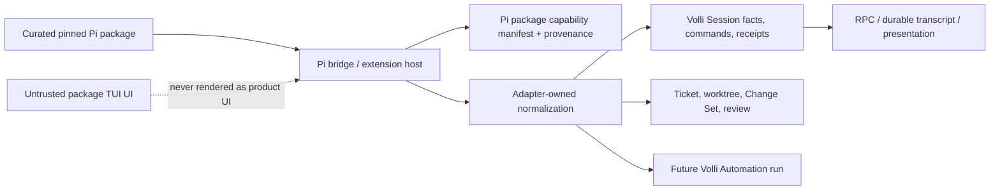

# Volli harness strategy: product-fit and roadmap contact test

> **Decision status — superseded 2026-08-08.** This remains the repository
> evidence record, but its asymmetric-hybrid recommendation is not the accepted
> product strategy. The accepted direction and migration boundary are recorded
> in [`docs/plans/pi-native-ticket-session.md`](../plans/pi-native-ticket-session.md).

**Repository-grounded decision memo — 2026-08-08**

**Decision input:** [external harness strategy report](/Users/phalasiya/Desktop/code/volli-code/docs/research/volli-harness-strategy.md:6).

**Method:** source and tests over plan prose; GitHub issues were read on 2026-08-08. No product code or issue state was changed.

## Bottom line

The external report's **asymmetric hybrid** recommendation survives contact with Volli, but the implementation should be even more asymmetric than the abstract strategy implies:

1. Ship Volli as an opinionated, durable **SDLC control plane**—Ticket → isolated worktree → explicit Session → Change Set/review/recovery—not as a generic chat wrapper.
2. Treat **OpenCode as the sole certified structured producer today**. Keep Claude Code, Codex, Cursor, and custom harnesses as valuable terminal `liveBestEffort` paths, not as implied native peers. Electron registers exactly one native adapter, OpenCode, at present. [Registration](/Users/phalasiya/Desktop/code/volli-code/apps/desktop/src/main/index.ts:395)
3. Add a second structured producer only behind one shared semantic conformance suite and a supported-upgrade policy; Claude Agent SDK is attractive *if and only if* entitlement and approval are settled. Do not make a Claude subscription fallback promise. The market report documents both the SDK leverage and the unresolved third-party Claude-login entitlement. [Market evidence](/Users/phalasiya/Desktop/code/volli-code/docs/research/volli-harness-strategy.md:47)
4. Run Pi as a **gated candidate/evals programme**, not a replacement programme. Its package ecosystem materially improves the upside of Pi, but it does not convert third-party extensions into trustworthy product features or erase the safety, durability, compatibility, and curation work.

**Decision:** fund the common Session/product work and two-producer certification first; fund a narrow Pi bridge plus a curated-package evaluation lane in parallel; defer Pi-primary, Pi-plus-Claude fallback, and Claude-compatible non-Claude gateway claims. This preserves the option to own a loop while compounding product value under every alternative.

**Confidence:** medium-high in the programme sequence; medium in the eventual hybrid destination; low that the current codebase justifies a Pi-primary launch. The uncertainty is empirical—recurring user value, supported Claude terms, Pi extension quality, and second-adapter semantic fit—not a lack of architecture diagrams.

## What Volli genuinely is today

The public README calls the app terminal-first and chat-first Sessions a planned architecture, while the newer migration-readiness plan calls chat production. [README](/Users/phalasiya/Desktop/code/volli-code/README.md:7) [Readiness plan](/Users/phalasiya/Desktop/code/volli-code/docs/plans/session-ui-migration-readiness.md:1) Source supports a middle reading: the durable structured spine is real and OpenCode chat has a meaningful vertical slice, but the surface is incomplete and single-producer. The README should therefore not be used as a current capability inventory, and the OpenCode audit's statement that chat is lab-only is stale relative to the later chat store and desktop registration. [Stale audit claim](/Users/phalasiya/Desktop/code/volli-code/docs/plans/opencode-surface-audit.md:11) [Durable chat creation](/Users/phalasiya/Desktop/code/volli-code/apps/desktop/src/renderer/src/stores/chat-sessions.ts:182)

| Product area | Maturity | What exists now | Strategic consequence |
| --- | --- | --- | --- |
| Tickets, board, worktrees, Change Sets, files | **Production foundation** | Ticket worktrees are app-owned; Change Sets measure committed and uncommitted work against the merge-base and protect out-of-worktree paths. [Worktree home](/Users/phalasiya/Desktop/code/volli-code/apps/desktop/src/main/worktree-runtime.ts:60) [Change Set](/Users/phalasiya/Desktop/code/volli-code/apps/desktop/src/main/worktree/change-set.ts:85) | This is Volli's differentiating asset under every harness choice. |
| Terminal execution and harness integration | **Production, terminal-only semantics** | The built-in terminal registry covers Claude Code, Codex, Cursor, and OpenCode; it provides launch/resume/hooks/skills surfaces rather than structured native execution. [Registry](/Users/phalasiya/Desktop/code/volli-code/packages/shared/src/harness/core.ts:16) [Claude descriptor](/Users/phalasiya/Desktop/code/volli-code/packages/shared/src/harness/claude-code.ts:15) [Codex descriptor](/Users/phalasiya/Desktop/code/volli-code/packages/shared/src/harness/codex.ts:78) | Retain it as distribution and continuity, but do not call it multi-harness structured parity. |
| Durable Session/ledger/receipts | **Production core, young** | Session creation records identity, command, ordered facts, and receipt transactionally; SQLite rejects non-monotonic event sequence and separately stores commands/receipts. [Engine transaction](/Users/phalasiya/Desktop/code/volli-code/packages/session-engine/src/session-engine.ts:115) [Ledger ordering](/Users/phalasiya/Desktop/code/volli-code/apps/desktop/src/main/session-control/sqlite-ledger.ts:180) | The highest-option-value investment: independent of loop, model, or UI. |
| Structured adapters and RPC/IPC | **Partial; one real producer** | The adapter interface can probe/attach/dispatch/reconcile/release, and Session RPC carries its stream; only OpenCode is registered in desktop. [Adapter contract](/Users/phalasiya/Desktop/code/volli-code/packages/session-engine/src/native-adapter.ts:239) [Desktop registry](/Users/phalasiya/Desktop/code/volli-code/apps/desktop/src/main/index.ts:421) | The seam is promising, not proof of portfolio readiness. |
| OpenCode chat, transcript, interactions | **Partial certified candidate** | OpenCode maps SSE into durable observations; chat persists Session before attaching, has a resident subscription, and uses transient overlays plus durable settle points. OpenCode mapping (`packages/opencode-adapter/src/index.ts:1180`, deleted in Session 7) [Chat bootstrap](/Users/phalasiya/Desktop/code/volli-code/apps/desktop/src/renderer/src/stores/chat-sessions.ts:182) [Overlay contract](/Users/phalasiya/Desktop/code/volli-code/packages/session-engine/src/session-runtime.ts:174) | Valuable anchor for a conformance suite; not a reason to make OpenCode assumptions universal. |
| Runtime catalog and capability-honest UI | **Partial** | A native profile has explicit capabilities and catalog items; the catalog is project-directory scoped. [Capability shape](/Users/phalasiya/Desktop/code/volli-code/packages/session-engine/src/native-adapter.ts:37) [Catalog scope](/Users/phalasiya/Desktop/code/volli-code/apps/desktop/src/main/index.ts:430) | Correct foundation for selected Pi packages and varied harnesses, but needs extension provenance/trust semantics. |
| Attachments/context | **Production foundation; incomplete structured input** | Ticket attachments are stored separately, safely materialized into the Session checkout, and their prompt projection is pure. [Storage boundary](/Users/phalasiya/Desktop/code/volli-code/apps/desktop/src/main/attachment-store.ts:2) [Materialization](/Users/phalasiya/Desktop/code/volli-code/apps/desktop/src/main/attachment-materialize.ts:50) | Reusable for every loop; structured adapter must faithfully pass file/image/agent input. The current OpenCode audit records those message parts as dropped. [Gap](/Users/phalasiya/Desktop/code/volli-code/docs/plans/opencode-surface-audit.md:96) |
| Automations | **Planned/lab, not product execution** | The shared ticket model explicitly defers status-entry automation; the repository contains a browser-only automation lab and only actor/base-branch preparation in production. [Deferred model](/Users/phalasiya/Desktop/code/volli-code/packages/shared/src/ticket.ts:4) [Lab files](/Users/phalasiya/Desktop/code/volli-code/apps/desktop/src/renderer/lab/automation/model.ts:1) | Do not count Pi workflows as “Volli Automations” until a durable trigger/run/audit model exists. |
| Review/Change Sets | **Production Change Set; review is partial/exploratory** | Change Set snapshot and renderer diff/file surfaces exist; the open issue still names in-app PR review as exploration. [Change Set reads](/Users/phalasiya/Desktop/code/volli-code/apps/desktop/src/main/worktree/change-set.ts:88) [Review issue](https://github.com/hussainph/volli-code/issues/82) | Better product wedge than duplicating a harness transcript. |
| Editor/files | **Production foundation** | The renderer has separate ticket/project files and Monaco live-reconciliation components; code stays in the worktree rather than an agent-owned sandbox. [File workspace model](/Users/phalasiya/Desktop/code/volli-code/packages/shared/src/file-workspace.ts:1) [Live reconciliation](/Users/phalasiya/Desktop/code/volli-code/apps/desktop/src/renderer/src/components/editor/live-reconciliation-affordance.tsx:1) | A Pi loop should operate in this substrate, not replace it with extension-specific worktrees. |
| Recovery and lifecycle | **Mixed** | Terminal resume is mature compatibility infrastructure; the structured runtime has reconcile/release primitives, but post-relaunch chat binding recovery is explicitly missing. [Reconcile/release](/Users/phalasiya/Desktop/code/volli-code/packages/session-engine/src/native-adapter.ts:230) [Known gap](/Users/phalasiya/Desktop/code/volli-code/docs/plans/session-ui-migration-readiness.md:46) | Blocks “Pi is safer/more owned” positioning until repaired. |
| CLI/control plane | **Production compatibility and integration asset** | `volli` provides agent-facing socket commands/hooks and correlates the `VOLLI_SESSION` environment; it is a strong bridge for terminal harnesses. [CLI command path](/Users/phalasiya/Desktop/code/volli-code/packages/cli/src/run.ts:54) [Hook correlation](/Users/phalasiya/Desktop/code/volli-code/packages/cli/src/hook.ts:158) | Reusable for Pi package → ticket/session/review triggers, subject to an authority model. |
| Tests/release | **Strong core coverage; incomplete diversity proof** | CI runs protected coverage and built assets; an OpenCode chat smoke exists, but it uses a fake OpenCode binary and is not a two-producer certification suite. [CI gate](/Users/phalasiya/Desktop/code/volli-code/.github/workflows/ci.yml:79) Chat smoke (`apps/desktop/e2e/session-chat-smoke.mjs:1`, deleted in Session 7) | Do not expand harness claims faster than producer-level integration/e2e proof. |

### Architectural assets and liabilities

**Assets that compound regardless of strategy.** The Session stays valid independently of a terminal attachment, with structured-only sessions deliberately given an honest chat listing rather than fabricated terminal facts. [Session/terminal split](/Users/phalasiya/Desktop/code/volli-code/packages/shared/src/session.ts:11) The engine persists intent before delivery and makes replay/idempotence first-class. [Submit path](/Users/phalasiya/Desktop/code/volli-code/packages/session-engine/src/session-engine.ts:285) Transcript artifacts are content-addressed and checksum-verified. [Artifact store](/Users/phalasiya/Desktop/code/volli-code/apps/desktop/src/main/session-runtime/transcript-artifacts.ts:16) The project also has an unusually useful local substrate: safe worktrees, attachments, board history, generated harness setup, a CLI socket, diffs, and a local-first desktop distribution.

**Liabilities that must affect the decision.** The presentation/semantic seam is not complete: the transcript-design plan correctly notes that opaque `UIMessage` parts leave OpenCode tool-name knowledge in renderer code and that `todo.updated` is synthesized as a fake tool call. [Seam diagnosis](/Users/phalasiya/Desktop/code/volli-code/docs/plans/chat-transcript-design.md:185) The OpenCode audit counts only three of twelve part types handled and records unbuilt subagent transcripts, checkpoints/revert, compaction/context, background processes, commands/skills/MCP invocation, and turn usage. [Surface gap](/Users/phalasiya/Desktop/code/volli-code/docs/plans/opencode-surface-audit.md:96) Finally, OpenCode is a single real producer, so generic types and fakes prove transport/ledger behavior rather than semantic portability.

## Sunk cost versus option value

Do **not** preserve a layer merely because it exists. The appropriate test is whether it improves a user outcome under more than one plausible strategy.

| Investment | Value under all five paths | Strategy-specific value / possible burden | Decision |
| --- | --- | --- | --- |
| Session identity, ledger, commands, receipts, transcript artifacts, RPC | Durable local history, observability, recovery, auditability, presentation portability | Pi-only can use it as its canonical run record; Claude-only can use it as the product wrapper; multi-harness needs it. | **Preserve and accelerate.** |
| Ticket/worktree/Change Set/files/attachments/CLI | The SDLC control plane that model loops do not supply | Pi extensions may offer overlapping todo/worktree/review behavior, but Volli's version should stay canonical. | **Preserve; integrate, do not replace.** |
| Terminal registry, trust, wrappers, hooks, resume | Immediate BYO distribution, fallback continuity, migration escape hatch | It is maintenance burden if marketed as semantic parity; some descriptors need upstream-specific upkeep. | **Retain as a tiered compatibility product.** |
| OpenCode adapter and chat UI | First real source for the generic Session seam; valuable baseline/eval harness | Its OpenCode-specific activity/tool assumptions become debt if copied into a second adapter. | **Harden, normalize, and use for certification—not universalize.** |
| Current renderer tool presentation | Useful user learning and UI components | String/tool-name matching, fake todo messages, and provider-shaped details are rework under any multi-harness or Pi route. | **Rework behind closed semantic descriptors.** |
| Pi package features (if adopted) | Potential feature supply and user demand discovery | Arbitrary npm code and TUI affordances cannot become a product guarantee by installation alone. | **Curate/evaluate; do not treat catalog as shipped surface.** |

## Does Pi's package catalog change the decision?

**It strengthens the case for keeping Pi as a funded option, not for making it primary now.** Pi's catalog currently exposes 5,348 npm-published packages and shows packages for subagents, plans, questions/permissions, workflows, todos, LSP, memory, sandboxing, and review-like work. [Pi catalog](https://pi.dev/packages) Its own package documentation is explicit that packages bundle executable extensions/skills/prompts/themes, install from npm/git/local paths, and that extensions run with full system access; project configuration may also auto-install missing packages after a project becomes trusted. [Pi package docs](https://github.com/earendil-works/pi/blob/main/packages/coding-agent/docs/packages.md)

That is a meaningful **feature-supply and experiment-discovery advantage** over building every agent-loop affordance internally. It could let Volli learn quickly which workflows users value and borrow implementation ideas or narrowly integrate a maintained package. It does *not* establish quality, compatibility, security, adoption, task performance, or durable semantic fit: catalog count and the displayed download numbers are publication/distribution indicators, not evidence that any extension meets Volli's product bar.

### Concrete seam: curated Pi packages, not a package marketplace

The minimum viable integration is a **Pi bridge** that hosts a pinned, allow-listed package set and translates only declared, reviewed capabilities into Volli facts. Pi's extension UI remains inside Pi's terminal/terminal-only profile unless Volli intentionally implements a semantic equivalent. The bridge needs all of the following before a package can be called first-class:

| Requirement | Existing Volli foundation | New work required |
| --- | --- | --- |
| Discovery/provenance | Native capability catalog already represents models, agents, commands, MCP, skills, and tools. [Catalog type](/Users/phalasiya/Desktop/code/volli-code/packages/shared/src/session-ledger.ts:61) | Add package name/version/source/digest, publisher approval, capability declaration, and “curated/experimental/terminal-only” support tier. |
| Trust and installation | Harness manifests already have exact-hash trust and an explicit registry path. [Registry contract](/Users/phalasiya/Desktop/code/volli-code/apps/desktop/src/main/harness-registry.ts:1) | A package lockfile, signature/digest verification, review screen, transitive dependency inventory, rollback/quarantine, and no auto-install from project configuration. Pi's default package model is unsafe as Volli product policy. |
| Semantic normalization | Adapter observations already model text, turns, interactions, attention, capabilities, and native lifecycle. [Observation union](/Users/phalasiya/Desktop/code/volli-code/packages/session-engine/src/native-adapter.ts:135) | Pi extension events/tools/commands must map to a versioned Volli semantic vocabulary. Close the activity descriptor seam first; do not pass tool names or arbitrary payloads into React. |
| Non-TUI interactions | Volli has durable `SessionInteraction` and command resolution. [Command union](/Users/phalasiya/Desktop/code/volli-code/packages/session-engine/src/native-adapter.ts:65) | A Pi interaction adapter for permission/question/choice and a negative-capability path when an extension only draws a TUI prompt. No screen scraping. |
| Lifecycle/durability/recovery | Durable ledger, artifacts, receipts, stream cursor and `reconcile` are already first-class. [Runtime ports](/Users/phalasiya/Desktop/code/volli-code/packages/session-engine/src/session-runtime.ts:86) | Correlate Pi run/turn/tool/subagent identities, settle/reconcile after crash, prevent replayed tool work, and define extension state restore. |
| Permissions/sandboxing | Worktree location and attachment materialization give a scoped local workspace. [Location contract](/Users/phalasiya/Desktop/code/volli-code/packages/session-engine/src/session-runtime.ts:42) | Execution policy, sandbox/container integration, secrets boundaries, network/process/file grants, package tool allow-list, and audit events. Pi itself says it lacks a built-in permission system; the external report makes this TCO explicit. [Market report](/Users/phalasiya/Desktop/code/volli-code/docs/research/volli-harness-strategy.md:62) |
| Tickets/review/automations | Ticket/worktree/Change Set/CLI infrastructure is real. [Change Set](/Users/phalasiya/Desktop/code/volli-code/apps/desktop/src/main/worktree/change-set.ts:88) | A durable Automation domain and authority model; Pi package “workflow” cannot write tickets, move columns, or open review without explicit Volli commands and receipts. |
| Compatibility/evals | OpenCode adapter tests and chat smoke establish a starting pattern. Adapter test surface (`packages/opencode-adapter/src/index.test.ts:1`, deleted in Session 7) | Per-package compatibility matrix, fixture traces, upgrade canary, kill switch, supply-chain review, and user-visible unsupported state. |

The right product promise is therefore: **“Volli certifies a small set of Pi capabilities and connects them to durable Sessions and SDLC objects.”** It is not “install any Pi package in Volli,” nor “Volli now has every feature whose package exists.” Curated consumption can avoid building *provider-specific loop features* from zero; it cannot avoid building the product-grade bridge that makes those features safe, durable, intelligible, and composable with worktrees/review.

## Feature-by-strategy matrix

Legend: **P** preserve, **A** accelerate, **R** rework, **D** defer, **O** obsolete/avoid as a promise, **N** material new burden.

| Product area | 1. Symmetric multi-harness | 2. Pi-only | 3. Pi + Claude fallback | 4. Claude SDK / gateway | 5. Asymmetric hybrid |
| --- | --- | --- | --- | --- | --- |
| Durable Session/ledger/RPC | P/A | P/A | P/A | P/A | **P/A** |
| Ticket/worktree/attachments/Change Set/review | **A** | A | A | A | **A** |
| Terminal harness registry/CLI | P/A (tiers) | D, retain migration escape | P | D, retain escape | **P/A** |
| OpenCode adapter | R to conformance | D/terminal-only | D/terminal-only | D/terminal-only | **A as certified producer** |
| Claude Code terminal adapter | P | D | P | P during migration | **P as terminal tier** |
| Second structured adapter | N per producer | N only if migration hedge | **N plus fallback semantics** | **N, Claude SDK bridge** | **N, one chosen producer** |
| Chat presentation/activity semantics | R once, then A | R/A for Pi vocabulary | R/A twice | R/A for Claude vocabulary | **R once, A selectively** |
| Pi loop | D/evals only | **N: primary runtime** | **N: primary plus bridge** | O | **N: gated candidate** |
| Pi package curation/extension bridge | D | **N** | **N** | O | **N, experimental lane** |
| Permissions/sandbox/evals | A per adapter boundary | **N, product-critical** | **N, product-critical twice** | N around SDK/credentials/gateway | **A for certified profiles; Pi research** |
| Claude entitlement/gateway drift | D | O | **N** | **N, launch-critical** | D until written approval |
| Automations | A as provider-neutral commands | A but do not delegate ownership | A plus ambiguity control | A | **A** |
| Release/support operations | N×supported harness | N×Pi/core/packages | **highest N: Pi + Claude** | N×Anthropic/gateway | **bounded N×two certified paths** |

### Blast radius and migration character

Relative effort/risk assumes one production-grade certified route means mapping lifecycle, input, streaming, interactions, capabilities, recovery, errors, test fixtures, packaged smoke, docs, and upgrade ownership—not merely starting a process.

| Alternative | Packages / main-preload / renderer / persistence / tests-release | Relative risk | Migration path |
| --- | --- | --- | --- |
| 1. Symmetric multi-harness | Repeated adapter packages and Electron host registration; renderer must be fully semantic; ledger/RPC mostly preserved; conformance/e2e multiplies per producer. | **High, linear ongoing cost** | First normalize activity/interactions, then certify a deliberately small second producer before admitting more. |
| 2. Pi-only | New Pi adapter/runtime host, package policy, model/auth, sandbox, prompts/evals; terminal code becomes compatibility only; Session remains reusable. | **Very high, concentrated path dependency** | Build an isolated Pi bridge/eval harness first; no migration of default users until recovery/safety/task gates pass. |
| 3. Pi primary + Claude fallback | Pi-only work plus Claude SDK/terminal bridge, cross-profile selection, explicit transcript/replay and permission discontinuity, double test/release matrix. | **Highest** | Do not implement fallback semantics. Offer distinct pinned profiles if evidence later justifies both. |
| 4. Claude SDK primary/only + gateways | New Claude host, auth/credential UI, event mapping, version/gateway compatibility; generic Session survives; terminal adapters become secondary. | **High external dependency** | Only after written entitlement/SDK contract and an API-key economics test; reject non-Claude gateway marketing absent supported compatibility. |
| 5. Asymmetric hybrid | Preserve main/preload/persistence seam; finish renderer semantics; add one certified adapter; retain terminal profile registry; Pi work isolated behind bridge/evals. | **Moderate, staged** | Common work → OpenCode certification → second producer → Pi decision gate; every stage produces user value. |

## Roadmap interaction and opportunity cost

The current roadmap thesis is explicit: local-first, arbitrary compatible harnesses, deeper adapters for a small first-class set, and durable orchestration rather than raw model access. [Roadmap](/Users/phalasiya/Desktop/code/volli-code/docs/ROADMAP.md:7) That thesis is best amplified by alternative 5, because it lets Volli invest in the job only it owns: make agent work inspectable, recoverable, reviewable, and attached to the right codebase/worktree.

The current open-issue set points in the same direction, but is not evidence that delivery exists: it contains durable-session resume ([#45](https://github.com/hussainph/volli-code/issues/45)), app-side memory for parallel sessions ([#51](https://github.com/hussainph/volli-code/issues/51)), Change Set plus AI review threads ([#43](https://github.com/hussainph/volli-code/issues/43)), an in-app PR-review exploration ([#82](https://github.com/hussainph/volli-code/issues/82)), a user-configurable automation system ([#79](https://github.com/hussainph/volli-code/issues/79)), and a socket threat model ([#100](https://github.com/hussainph/volli-code/issues/100)). These are precisely control-plane and trust problems; a Pi package might inform one, but should not silently become its implementation or authority source.

| Roadmap item | Hybrid effect | Pi-primary effect | Claude-SDK-primary effect |
| --- | --- | --- | --- |
| Close OpenCode transcript gaps: semantic activity, subagents, context, attachments, checkpoint/review | Directly advances one certified path and the common contract | Some becomes throwaway if Pi is default | Mostly reusable presentation work, but new provider mapping |
| Durable recovery/reconciliation | Common, mandatory | Mandatory plus Pi extension state/sandbox recovery | Mandatory plus SDK/auth/gateway reconnect |
| Ticket/Change Set/review workflow | Directly differentiating | Delayed by loop/eval/safety work | Delayed by provider integration and policy drift |
| Automations | Build as provider-neutral durable commands | Temptation to turn extension workflows into a competing scheduler | Must avoid SDK-specific automation semantics |
| Multi-agent/subagent visibility | Define portable child-thread policy before second producer | Pi packages can offer fast prototypes but not a durable contract | Rich SDK may expose it quickly but anchors vocabulary |

Opportunity cost is the deciding pressure. Symmetric support consumes ongoing engineering in each upstream's event, auth, tool, capability, test, and release drift. Pi ownership consumes those costs **plus** tool policy, sandboxing, context management, prompt/task regressions, package supply chain, and evals. Pi+Claude adds the cognitive cost of deciding whether a model turn, permission, resume, tool, transcript, and billing route belongs to Pi or Claude. Claude-SDK/gateway consumes less loop invention but makes Anthropic approval, SDK release cadence, gateway compatibility, credentials, and changing commercial terms part of Volli's critical path. The external report identifies the same concentration and TCO shape. [TCO comparison](/Users/phalasiya/Desktop/code/volli-code/docs/research/volli-harness-strategy.md:103)

The work that should *not* be displaced is (a) structured crash/relaunch recovery, (b) semantic normalization, (c) ticket/worktree/change review flow, (d) a durable Automation domain, and (e) a second-producer conformance suite. These are the investments that make every later harness better rather than merely making the next demo richer.

## Reversibility, path dependency, and gates

### Safe common work now

- Make activity, plan, subagent, interaction, attachment, checkpoint, and turn-usage semantics explicit at the adapter boundary; remove renderer dependence on provider tool names. The planned `ActivityKind` direction is correctly scoped as an adapter mapping with no engine/RPC migration. [Design proposal](/Users/phalasiya/Desktop/code/volli-code/docs/plans/chat-transcript-design.md:185)
- Finish structured recovery and make its contract observable in a packaged smoke. The current boot-recovery gap is known, not hypothetical. [Known risk](/Users/phalasiya/Desktop/code/volli-code/docs/plans/session-ui-migration-readiness.md:46)
- Establish adapter conformance fixtures and a second genuinely independent producer; fake adapters and OpenCode-shaped labs remain useful unit tests, but not portability evidence.
- Build review/Change Set and future Automation commands as Session-owned operations with receipts, not provider plug-in side effects.
- Keep terminal compatibility, exact trust, and resume distinct from native structured continuation. The project model already distinguishes `fresh`, `native_resume`, `context_replay`, and `recreate`. [Continuity types](/Users/phalasiya/Desktop/code/volli-code/packages/shared/src/session-ledger.ts:15)

### Choices to avoid locking in now

- Do not persist provider-specific Pi extension state as canonical Session facts without a versioned adapter-owned mapping.
- Do not treat a Pi package's TUI, tool string, or extension-local todo/workflow as Volli product state.
- Do not present Claude as a seamless “fallback” or promise subscription-funded embedded use before written approval. [Policy risk](/Users/phalasiya/Desktop/code/volli-code/docs/research/volli-harness-strategy.md:49)
- Do not bend the common presentation layer around Claude or Pi before two independent producers prove a semantic universal.
- Do not add arbitrary Pi package auto-install/update to trusted project startup; Pi documents that installed extension code has full system access. [Pi package security note](https://github.com/earendil-works/pi/blob/main/packages/coding-agent/docs/packages.md)

### Decision gates

| Gate | Evidence required to advance | Decision if it fails |
| --- | --- | --- |
| G1: Session product seam | Structured re-launch/reconcile smoke; activity/interactions no longer renderer/provider-name coupled | Keep terminal-first compatibility; do not add a second adapter yet. |
| G2: Portfolio reality | OpenCode plus one non-OpenCode producer pass identical semantic, negative-capability, recovery, and packaged e2e traces | If only one passes, remain asymmetric with one native producer. |
| G3: Claude route | Written entitlement approval, supported auth path, cost model, and upgrade/recovery smoke | Retain Claude terminal profile; no SDK-primary plan. |
| G4: Pi core | Pi bridge passes task/recovery/sandbox/eval baselines against the chosen recurring workflows | Keep Pi terminal/experimental; do not make it default. |
| G5: Curated package | Pin/provenance/trust, declared semantic mapping, no TUI dependency, permission boundary, upgrade canary, and user benefit in repeated use | Expose terminal-only or reject/quarantine it. |
| G6: Pi primary | Pi materially improves a repeated SDLC job over certified alternatives and team can sustain safety/evals/extension support | Promote Pi profile; otherwise retain it as option value. |

## Steelman cases that could change the route

**Symmetric multi-harness is stronger here than in a blank product.** Volli already has the terminal registry, manifest/trust/wrapper infrastructure, worktree substrate, durable Session records, and a clearly stated local-first BYO-harness promise. [Terminal registry](/Users/phalasiya/Desktop/code/volli-code/packages/shared/src/harness/core.ts:16) [Roadmap promise](/Users/phalasiya/Desktop/code/volli-code/docs/ROADMAP.md:13) If the target user truly runs several harnesses daily and mostly needs their work operationalized rather than their turns redesigned, selective multi-harness support is the natural distribution wedge. The rejection is only of **symmetric parity as a support promise**: one producer and the current presentation seam do not yet sustain it.

**Pi is materially more interesting because of the catalog.** A maintained, pinned package could provide a fast proof point for workflow, planning, LSP, review, sandbox, or subagent value, and Pi's embeddable OSS loop makes direct integration technically plausible. That can reduce invention time and lets Volli test differentiated agency rather than wait for every internal feature. It becomes a winning primary route only if Volli can own the dangerous and differentiating layers—the package policy, tool/permission/sandbox authority, lifecycle/recovery, semantic adapter, reliability evaluation, and support policy—without starving the worktree/review control plane.

**Claude SDK primary is stronger if entitlement becomes clean.** It could give Volli a high-quality loop with tools, subagents, sessions, permissions, and observability before rebuilding them. The external report's warning remains decisive: third-party auth/plan use and gateway routing are policy/compatibility dependencies, so it is an excellent selected producer candidate after approval, not a durable independence strategy. [Claude analysis](/Users/phalasiya/Desktop/code/volli-code/docs/research/volli-harness-strategy.md:47)

## Recommended programme topology

| Main delivery map | Research/evals map | Explicitly defer |
| --- | --- | --- |
| Provider-neutral Session semantics; recovery; semantic renderer; OpenCode gap closure; Change Set/review; durable Automation domain; conformance + two-producer smoke; terminal support tiers | Pi bridge prototype; curated package shortlist and threat/compatibility tests; Pi task/economics/sandbox comparison; Claude SDK entitlement and API-key evaluation; ACP feasibility where it supplies a real producer | Pi-primary default; Pi+Claude fallback; arbitrary Pi marketplace; Claude-compatible non-Claude inference promise; symmetric feature parity; cloud/background execution work unrelated to repeated local SDLC outcomes |

This topology gives Pi its genuine strategic upside—an owned loop and extension supply pool—without spending the core roadmap on an unproven, broad product surface. It also lets a favorable Claude decision become an additive certified profile, not a rewrite of Volli's source of truth.

## Final decision table

| Alternative | Codebase fit now | Market/operational risk | Strategic judgement |
| --- | --- | --- | --- |
| 1. Symmetric multi-harness | Medium at core, low at actual producer diversity | High adapter-parity/support tax | Do not pursue as a promise; use tiered terminal support and certify selectively. |
| 2. Pi-only owned harness | Medium reuse of Session/worktree, low loop/safety readiness | Very high ownership/eval/sandbox/package risk | Valuable option and research programme, not current default. |
| 3. Pi primary + Claude fallback | Low; would create two incompatible operational contracts | Highest | Reject for now; use explicit separate profiles if both later earn certification. |
| 4. Claude SDK primary/only + gateways | Medium technical fit, contingent commercial fit | High entitlement/gateway/vendor concentration | Conditional experiment only after approval; no gateway portability claim. |
| 5. Asymmetric hybrid | **Highest**: it uses durable Session, OpenCode, terminal compatibility, worktrees, review, and the Pi option | Moderate and controllable with support tiers | **Adopt, with one native producer today, a second only after conformance, and Pi behind gates.** |

### Disconfirming conditions

Revisit the recommendation if any of these becomes true:

1. A Pi bridge demonstrates repeatable, material improvement in Volli's chosen ticket→worktree→review job while meeting recovery, sandbox, and ownership gates; Pi-primary then deserves a direct comparison.
2. Anthropic provides written approval and a durable commercial/authentication contract, and an SDK path materially reduces time-to-quality for the target workflows; Claude can become the selected second certified producer.
3. Two independent structured adapters expose so little shared semantic value that the portable presentation contract degrades into lowest-common-denominator UI; then invest more in the SDLC control plane and tiered provider-native surfaces rather than broad normalization.
4. Users value a single excellent loop far more than continuity across their installed harnesses, *and* this is shown in repeated behavior rather than preference interviews; that increases the owned-loop case.
5. Curated Pi packages meet provenance, no-TUI, safety, lifecycle, compatibility, and repeated-use tests at a cost materially lower than internal delivery; that raises Pi's option value, but still does not validate arbitrary catalog packages.

## Evidence ledger

- **External market input:** the companion strategy report supplies the five alternatives, Claude/Pi/OpenCode policy and TCO evidence; this memo accepts none of its repository assumptions without source checks. [Strategy report](/Users/phalasiya/Desktop/code/volli-code/docs/research/volli-harness-strategy.md:20)
- **Current structured reality:** desktop registers one OpenCode native adapter, despite a generic adapter registry. [Desktop](/Users/phalasiya/Desktop/code/volli-code/apps/desktop/src/main/index.ts:395) [Registry](/Users/phalasiya/Desktop/code/volli-code/packages/session-engine/src/native-adapter.ts:245)
- **Durable product core:** Session/command/event/receipt ordering is implemented in the engine and SQLite ledger. [Engine](/Users/phalasiya/Desktop/code/volli-code/packages/session-engine/src/session-engine.ts:115) [SQLite](/Users/phalasiya/Desktop/code/volli-code/apps/desktop/src/main/session-control/sqlite-ledger.ts:204)
- **Differentiating substrate:** worktrees, Change Sets, attachments, terminal compatibility, and the CLI are implemented independently of a future owned loop. [Worktrees](/Users/phalasiya/Desktop/code/volli-code/apps/desktop/src/main/worktree-runtime.ts:60) [Attachments](/Users/phalasiya/Desktop/code/volli-code/apps/desktop/src/main/attachment-materialize.ts:50) [Harness registry](/Users/phalasiya/Desktop/code/volli-code/packages/shared/src/harness/core.ts:22)
- **Known roadmap debt:** chat recovery and substantial OpenCode surface gaps remain documented and should be resolved from code/tests, not assumed closed from plan status. [Recovery](/Users/phalasiya/Desktop/code/volli-code/docs/plans/session-ui-migration-readiness.md:46) [Surface gaps](/Users/phalasiya/Desktop/code/volli-code/docs/plans/opencode-surface-audit.md:96)
- **Pi marketplace conclusion:** the public catalog establishes feature supply and its package docs establish full-system-access risk; neither establishes extension quality, adoption, or product suitability. [Catalog](https://pi.dev/packages) [Package security](https://github.com/earendil-works/pi/blob/main/packages/coding-agent/docs/packages.md)
