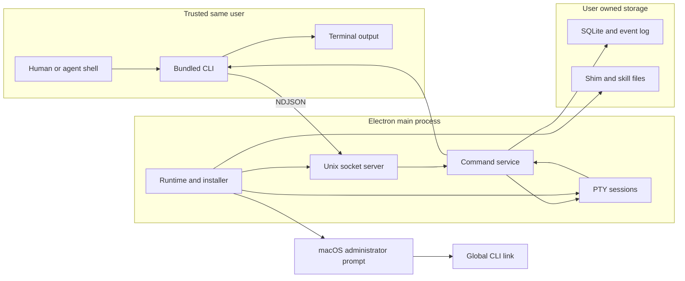

# Volli CLI threat model

## Executive summary

The Volli CLI is a local, single-player macOS control surface over a private Unix socket. Under the confirmed v1 trust model—processes running as the same macOS user, including tracked-repository code and agent sessions, are trusted—no critical or high-priority threat remains in the reviewed surface. The highest residual risks are accidental broad board mutations by an authorized agent and mistakes at the administrator-backed global-link boundary. This security pass hardened the concrete parser, terminal, IPC, process-environment, Git-ref, shim, and installer attack paths in `packages/cli/src/`, `apps/desktop/src/main/agent-*.ts`, and `apps/desktop/src/main/harness-install.ts`. This assessment does not claim sandboxing against a malicious same-user process; that would require a different isolation architecture.

## Scope and assumptions

In scope:

- The bundled CLI entry point, argument and file handling, app launch, Unix-socket client, response rendering, and exit behavior in `packages/cli/src/`.
- The v1 protocol and context-resolution contract in `packages/shared/src/agent-surface.ts` and the PTY environment contract in `packages/shared/src/volli-dir.ts`.
- The app-owned socket, command service, persistence mutations, session observation, notifications, shim generation, skill installer, and administrator-backed global link in `apps/desktop/src/main/`.
- The CLI build and blocking security-relevant CI gates in `packages/cli/vite.config.ts`, `apps/desktop/scripts/copy-cli.mjs`, and `.github/workflows/ci.yml`.

Out of scope:

- Sandboxing or defending against code already executing as the same macOS user. The user explicitly confirmed tracked-repository code and agent sessions are trusted in v1.
- Compromise of macOS, Electron, the signed application bundle, the package registry, or an administrator account.
- Renderer security unrelated to CLI-launched notices or CLI-created data, remote collaboration, multi-user authorization, and future worktree automation not present in PR 70.
- Generic terminal-agent risks such as an authorized coding agent modifying repository files; this model covers the Volli planning/observation surface it can reach.

Assumptions:

- Volli remains local-first, single-player, and macOS-only, with no TCP, HTTP, or internet-facing CLI endpoint (`docs/CONCEPT.md`, decisions 34–37; `apps/desktop/src/main/agent-socket.ts`, `startAgentSocket`).
- The macOS account boundary is the authorization boundary. The socket's `0600` mode and shim directory's `0700` mode prevent other local accounts from using the surface (`apps/desktop/src/main/agent-socket.ts`, `startAgentSocket`; `apps/desktop/src/main/agent-runtime.ts`, `ensureVolliCliShim`).
- Ticket content and PTY output may contain hostile or malformed text even though their producing same-user process is trusted; renderers must therefore remain terminal-safe (`packages/cli/src/render.ts`, `terminalSafeText` and `terminalSafeInline`).
- The app bundle and generated shim are trusted code. Caller-controlled launch paths and Node/loader injection variables are not trusted (`apps/desktop/src/main/agent-runtime.ts`, `ensureVolliCliShim`; `packages/cli/src/runtime.ts`, `appLaunchEnvironment`).
- SQLite under Electron `userData` is the authoritative planning and audit store (`apps/desktop/src/main/index.ts`, `dbPath`; `apps/desktop/src/main/agent-commands.ts`, `createAgentCommandService`).

Open questions that would materially change the ranking:

- None for the confirmed v1 deployment. Reassess before adding remote access, multiple OS users sharing one database, automatic ingestion of externally authored tickets, or an untrusted-repository execution model.

## System model

### Primary components

- **Generated shell shim and bundled CLI:** the app writes a user-private launcher that invokes the app's Electron runtime in Node mode against the bundled CLI (`apps/desktop/src/main/agent-runtime.ts`, `ensureVolliCliShim`; `packages/cli/src/index.ts`, `main`).
- **CLI parser/runtime/client/renderer:** arguments and optional local files become one typed request; the client performs one NDJSON exchange and renders stable text or JSON (`packages/cli/src/parser.ts`; `packages/cli/src/runtime.ts`; `packages/cli/src/client.ts`; `packages/cli/src/render.ts`).
- **Unix-socket server:** the Electron main process owns the local socket, validates the v1 envelope, bounds request size, connections, and incomplete-request time, and dispatches one request per connection (`apps/desktop/src/main/agent-socket.ts`, `startAgentSocket` and `handleConnection`).
- **Command service and SQLite:** commands resolve display IDs and context, enforce the published surface, perform transactional mutations, and write actor-attributed events (`apps/desktop/src/main/agent-commands.ts`, `createAgentCommandService`; `apps/desktop/src/main/ticket-commands.ts`).
- **PTY/session bridge:** Volli injects the socket, ticket/session identifiers, artifacts path, and private CLI directory into Volli-created terminal sessions; session observation is read-only (`packages/shared/src/volli-dir.ts`, `agentSessionEnv`; `apps/desktop/src/main/pty.ts`, `PtyManager`).
- **Skill and global-link installer:** consent-gated code writes hash-guarded skill files in the user's home and may invoke a macOS administrator prompt to create the global CLI link (`apps/desktop/src/main/harness-install.ts`, `applyHarnessInstallPlan`; `apps/desktop/src/main/agent-tools.ts`, `installGlobalCliLink`).
- **Build and CI:** the CLI is packed into one executable JS artifact, copied into the desktop build, and covered by typecheck, 100%-threshold tests, stable Electron smokes, and an advisory dependency audit (`packages/cli/vite.config.ts`; `apps/desktop/scripts/copy-cli.mjs`; `.github/workflows/ci.yml`).

### Data flows and trust boundaries

- **Trusted same-user shell → CLI:** arguments, environment context, current working directory, and explicitly named body/comment files cross the process boundary. The parser uses command-specific option specifications; file content is materialized client-side so arbitrary paths never cross the socket (`packages/cli/src/parser.ts`, `parseCliArgs`; `packages/cli/src/runtime.ts`, `materializeFileArguments`).
- **CLI → Electron main:** one newline-delimited JSON request crosses a local Unix socket. The socket is mode `0600`; requests are capped at one MiB, incomplete clients time out, active connections are capped, and the envelope, command, context, and environment field types are checked (`apps/desktop/src/main/agent-socket.ts`, `parseRequest` and `handleConnection`). There is no application token because same-user processes are trusted and an on-disk token would not create a meaningful same-user boundary.
- **Command service → SQLite/event log:** validated command arguments and resolved public display IDs cross into persistence. Mutations use shared command functions and transactions, write actor attribution, and expose archive rather than deletion (`apps/desktop/src/main/agent-commands.ts`, `requestActor` and `createAgentCommandService`; `apps/desktop/src/main/ticket-commands.ts`).
- **PTY manager → terminal processes:** Volli supplies PATH and `VOLLI_SOCKET`, `VOLLI_SESSION`, `VOLLI_TICKET`, and artifacts context to trusted same-user sessions (`packages/shared/src/volli-dir.ts`, `agentSessionEnv`; `apps/desktop/src/main/pty.ts`, `PtyManager.create`). No OS sandbox boundary is claimed.
- **PTY/ticket/database data → CLI terminal:** titles, labels, comments, event JSON, errors, and observed terminal output cross back to a terminal or pipe. JSON retains data semantics using JSON escapes; text output neutralizes C0/C1, OSC/CSI, bidi controls, carriage returns, and inline newlines (`packages/cli/src/render.ts`, `terminalSafeJson`, `terminalSafeText`, and `terminalSafeInline`).
- **Electron app → user configuration files:** bundled skill content and fenced instructions cross into harness-specific paths. Reads refuse symbolic/non-regular targets, writes use random exclusive temporary files plus atomic rename, and recorded hashes prevent silent overwrite of edited managed content (`apps/desktop/src/main/harness-install.ts`, `textAt`, `writeTextAtomically`, and `applyManagedAction`).
- **Electron app → administrator shell:** after explicit consent, a fixed AppleScript command may create `/usr/local/bin/volli`. Shell values are quoted, executables are absolute, an existing correct link is idempotent, and any unrelated destination is refused rather than replaced (`apps/desktop/src/main/agent-tools.ts`, `globalCliLinkShellCommand` and `installGlobalCliLink`).
- **Source/lockfile → built application:** developer-controlled TypeScript and locked dependencies cross the CI/build boundary. CI typechecks, builds, enforces protected 100% coverage, runs application smokes, and queries high-severity advisories (`.github/workflows/ci.yml`; `pnpm-lock.yaml`). The dependency audit is advisory because registry availability is external.

#### Diagram

## Assets and security objectives

| Asset | Why it matters | Security objective (C/I/A) |
|---|---|---|
| SQLite planning state | Tickets, comments, labels, project paths, and execution preferences drive the user's work | C/I/A |
| Actor-attributed event log | It explains whether a user, session, or automation caused a mutation | I/A |
| Live terminal observation | `session.peek` can contain source, commands, paths, and transient secrets | C/A |
| Unix socket | It is the only runtime entry point to the main-process planning surface | C/I/A |
| Public display-ID/context mapping | Incorrect resolution could mutate the wrong project or ticket | I |
| CLI bundle and generated shim | Path or environment substitution could redirect execution to attacker-controlled code | I/A |
| User-owned skill and instruction files | Silent overwrite would destroy custom agent configuration or inject instructions | I/A |
| `/usr/local/bin/volli` | It is an administrator-created global command name and must not clobber unrelated tools | I/A |
| Stable CLI output | Agents and users rely on truthful lines, error codes, and parseable JSON | I/A |
| Build inputs and dependency lockfile | A compromised artifact would run as the user's Electron process | I |

## Attacker model

### Capabilities

- An untrusted process under a different local macOS account may discover paths and attempt to connect to or replace accessible filesystem entries. It cannot legitimately pass owner-only socket or directory permissions.
- Untrusted text may be pasted into tickets, emitted by terminal programs, returned in errors, or stored in existing local data. It may contain escape sequences, bidi markers, embedded newlines, or very large values.
- A malformed local client may send incomplete, oversized, invalid, or unsupported NDJSON without being trusted as a conforming CLI client.
- A supply-chain attacker may attempt to introduce a vulnerable dependency or alter build inputs; this is conditional on compromising a developer or upstream source rather than a runtime network path.
- An authorized but mistaken same-user agent can invoke any published planning mutation, including repeated or cross-project moves; this is modeled as accidental misuse rather than hostile same-user code.

### Non-capabilities

- There is no remote network endpoint for an internet attacker to reach (`apps/desktop/src/main/agent-socket.ts`).
- Malicious code already running as the logged-in macOS user—including code in a tracked repository or agent session—is explicitly out of scope. Such a process could read the user's files and socket directly; v1 does not claim containment from it.
- A different local user cannot read the owner-private socket or traverse the owner-private CLI directory without a separate OS permission failure or privilege escalation.
- A runtime attacker cannot obtain administrator privileges without the user approving the native macOS prompt.
- The model assumes the installed Electron runtime and Volli application bundle have not already been replaced.

## Entry points and attack surfaces

| Surface | How reached | Trust boundary | Notes | Evidence (repo path / symbol) |
|---|---|---|---|---|
| CLI arguments | `volli <command> [options]` | Shell → CLI | Command-specific parser; unknown/missing options fail as usage errors | `packages/cli/src/parser.ts` / `parseCliArgs` |
| File-backed body/comment input | `--body-file` or `--file` | Local filesystem → CLI | Read by the CLI and converted to text; path itself is not sent to the app | `packages/cli/src/runtime.ts` / `materializeFileArguments` |
| Process environment and cwd | `VOLLI_*`, PATH, working directory | Shell → CLI/app | Context is explicit; app-launch authority and loader variables are scrubbed | `packages/cli/src/index.ts`; `packages/cli/src/runtime.ts` / `appLaunchEnvironment` |
| App launch | `volli app launch` | CLI → new Electron process | Explicit only; baked executable paths, sanitized child env, bounded readiness wait | `apps/desktop/src/main/agent-runtime.ts`; `packages/cli/src/runtime.ts` / `launchApp` |
| Unix socket | Local NDJSON connection | OS account → Electron main | `0600`, one request, one MiB cap, timeout, 64-connection cap, schema checks | `apps/desktop/src/main/agent-socket.ts` / `startAgentSocket` |
| Command dispatcher | Valid v1 command | Socket → domain/persistence | Public IDs, strict enums/branches/body mutations, transactions, typed failures | `apps/desktop/src/main/agent-commands.ts` / `createAgentCommandService` |
| Session observation | `volli session peek` | Main PTY state → CLI | Read-only and retained-output bounded by PTY manager; may expose terminal content | `apps/desktop/src/main/agent-commands.ts`; `apps/desktop/src/main/pty.ts` |
| Terminal/text renderer | Any non-JSON result or error | Stored/runtime text → terminal | Terminal-active controls and forged inline line breaks are escaped | `packages/cli/src/render.ts` / `terminalSafeText` |
| JSON renderer | Any command with `--json` | Stored/runtime data → pipe/terminal | Data-equivalent Unicode escapes prevent raw terminal control emission | `packages/cli/src/render.ts` / `terminalSafeJson` |
| Shim generation | Electron boot | App paths → userData filesystem | Random exclusive temp, atomic rename, `0700` parent, baked launch paths | `apps/desktop/src/main/agent-runtime.ts` / `ensureVolliCliShim` |
| Skill installation | First-run/menu consent | App bundle → user home | Final symlinks refused for managed files; atomic writes and hash conflicts | `apps/desktop/src/main/harness-install.ts` / `applyHarnessInstallPlan` |
| Global CLI installation | Approved native prompt | User app → administrator shell | Absolute tools, shell quoting, no-clobber destination checks | `apps/desktop/src/main/agent-tools.ts` / `globalCliLinkShellCommand` |
| Build/dependencies | CI or developer build | Source/upstream → shipped artifact | Lockfile, typecheck, protected coverage, smokes, advisory audit | `.github/workflows/ci.yml`; `pnpm-lock.yaml` |

## Top abuse paths

1. **Cross-account planner access:** another local account discovers the socket path → attempts an NDJSON mutation → owner-only socket permissions deny connection → no planning data is returned or changed. A regression in path permissions would expose all published planning commands.
2. **Local socket denial of service:** a malformed client opens many sockets or never sends a newline → the server caps active connections and terminates incomplete requests → availability impact is bounded. Repeated same-user flooding is outside the hostile actor model.
3. **Terminal escape injection:** crafted ticket or PTY content contains OSC 52, ANSI controls, carriage returns, bidi markers, or forged newlines → CLI output reaches a terminal → renderer emits visible escapes and preserves JSON semantics → clipboard/state mutation and inline record spoofing are prevented.
4. **Git option/ref injection:** a client persists an option-shaped or invalid base ref → later worktree automation passes it to Git → Git interprets an option or unintended ref. Both ticket create and update now apply `isValidBranchName`; future Git call sites must still use argument arrays and option terminators.
5. **App-launch code injection:** a caller sets `NODE_OPTIONS`, dynamic-loader variables, or fake `VOLLI_APP_*` paths → invokes `volli app launch` → the generated shim overwrites launch paths and the launcher removes control/injection variables → the trusted app starts without inherited CLI authority.
6. **Managed-file symlink overwrite:** a filesystem entry at a managed skill path becomes a dangling or live symlink → installer reads or writes it → no-follow reads reject non-regular files and atomic rename replaces only an allowed regular destination → the linked target is not overwritten.
7. **Privileged global-command clobber:** `/usr/local/bin/volli` already names another file or link → user approves installation → the elevated command refuses an unrelated destination and only accepts an exact existing link → another global command is preserved.
8. **Authorized automation blast radius:** a trusted session issues repeated create/update/move/archive operations or targets a different project explicitly → the command service performs valid mutations → board integrity is disrupted but every event is attributed and destructive deletion/settings/terminal driving remain unavailable. This is the principal medium residual risk under the v1 model.
9. **Terminal-data disclosure:** an authorized same-user CLI calls `session.peek` → observed output includes sensitive text → CLI displays it. The socket account boundary is the confidentiality control; no finer per-session authorization is claimed.

## Threat model table

| Threat ID | Threat source | Prerequisites | Threat action | Impact | Impacted assets | Existing controls (evidence) | Gaps | Recommended mitigations | Detection ideas | Likelihood | Impact severity | Priority |
|---|---|---|---|---|---|---|---|---|---|---|---|---|
| TM-001 | Different local OS user | Socket path is discoverable and OS permissions are weakened or bypassed | Connect and issue planning/observation commands | Read terminal/planning data or mutate the board | Socket, SQLite state, terminal observation | Socket `0600`; private CLI directory; no TCP listener (`apps/desktop/src/main/agent-socket.ts`, `startAgentSocket`; `apps/desktop/src/main/agent-runtime.ts`) | No application token or peer-credential check; authorization intentionally relies on macOS ownership | Keep the socket parent owner-private; retain startup mode verification; reassess peer credentials or a privilege-separated broker only for multi-user support | Log bind/chmod failures and repeated protocol failures without recording request bodies | Low: requires an OS-permission regression or separate local privilege issue | High: the published surface has broad planning read/write and session peek | medium |
| TM-002 | Malformed local client | Can reach the socket | Hold connections, flood requests, send oversized/invalid JSON | Main-process resource exhaustion or degraded CLI availability | Socket and app availability | One MiB requests, 10-second incomplete-request timeout, 64 connections, one request per connection, schema checks (`apps/desktop/src/main/agent-socket.ts`, `handleConnection`) | No per-identity rate limit; a command execution itself has no server-side deadline | Keep semantic caps on newly added commands; add lightweight counters if runtime abuse is observed; do not log attacker-sized payloads | Count timeouts, oversize rejects, dropped connections, and command latency | Low: reachable hostile same-user clients are out of scope and other users are denied | Medium: local app/CLI can become temporarily unavailable | low |
| TM-003 | Untrusted stored or terminal text | Content is displayed in CLI text/JSON output | Emit ANSI/OSC, C1, bidi, carriage-return, or inline-newline payloads | Clipboard mutation, terminal-state change, or misleading output | Stable CLI output, operator decisions | Control/bidi escaping, inline-line escaping, JSON-safe Unicode escapes, regression tests (`packages/cli/src/render.ts`; `packages/cli/src/render.test.ts`) | Multiline `ticket brief` and session output are intentionally multiline; visual Unicode confusables remain possible | Keep all new text renderers behind the central safe functions; use `--json` for automation; document that briefs/session output contain user content | Add golden tests for every new renderer and known terminal sequence class | Low after controls: hostile content can exist, but active controls are neutralized | Medium: could mislead a user/agent or mutate clipboard without code execution | low |
| TM-004 | Malformed CLI/socket input | Can create or update a ticket base branch | Store a flag-like or invalid Git ref for later automation | Wrong Git operation or future command injection at a careless call site | Project/worktree integrity | Shared Git-ref validation on create and update (`apps/desktop/src/main/agent-commands.ts`; `packages/shared/src/ticket-branch.ts`, `isValidBranchName`) | PR 70 does not implement all future Git worktree execution call sites | Require `execFile`/argument arrays and `--` at every future Git boundary; keep ref validation in shared domain code | Log rejected ref validation and Git argv at safe structured granularity without secrets | Low: invalid refs are rejected before persistence | High if a future privileged Git call reintroduces string-shell execution | low |
| TM-005 | Caller-controlled environment | User invokes explicit app launch from a manipulated shell environment | Redirect Electron launch or inject Node/dynamic-loader behavior | Execute unintended code as the user or open the wrong database/profile | CLI/app integrity, SQLite state | Launch paths baked into shim; random atomic shim replacement; child env removes `VOLLI_*`, Node, Electron renderer, and loader variables; production ignores test-only DB/installer overrides (`apps/desktop/src/main/agent-runtime.ts`; `packages/cli/src/runtime.ts`; `apps/desktop/src/main/index.ts`) | A trusted same-user caller still controls general inherited environment and can execute arbitrary programs directly | Keep an explicit denylist for newly introduced runtime control variables; consider a small allowlist if app-launch behavior expands | Record only that launch came from CLI and surface startup-path failures; never log full env | Low after controls and under trusted same-user model | High: successful process injection runs with user authority | low |
| TM-006 | Filesystem race or crafted managed path | Installer consent is granted and a managed destination is replaced by a symlink/non-file | Follow a link or race a predictable temp to overwrite another file | Corrupt user configuration or install attacker-controlled instructions | Skill files, user instructions, shim | No-follow reads, non-regular refusal, random `wx` temps, atomic rename, hash guard, `0700` shim dir, symlinked bin-dir refusal (`apps/desktop/src/main/harness-install.ts`; `apps/desktop/src/main/agent-runtime.ts`) | Parent configuration directories may themselves be symlinks; same-user parent manipulation is out of scope | Preserve final-path checks and atomic writes; show actionable conflict/errors; add parent ownership checks only if supporting untrusted homes | Surface installer errors and conflict paths in the existing native dialog; never include file contents in telemetry | Low: final-path attacks are blocked and malicious same-user races are out of scope | High: agent instructions or executable shim integrity could be lost | medium |
| TM-007 | Privileged installer misuse | User approves the macOS administrator prompt | Replace an unrelated global command or follow a destination symlink | System-wide command integrity loss or broken CLI | `/usr/local/bin/volli`, user trust | Absolute commands, shell quoting, exact-link idempotency, unrelated-destination refusal, no force flag, ownership check on uninstall (`apps/desktop/src/main/agent-tools.ts`) | Native prompt cannot explain a race after approval; `/usr/local/bin` ownership varies across Macs | Keep no-clobber behavior and exact-target uninstall; code-sign/notarize release before distribution | Surface administrator command stderr in the existing failure dialog; log only operation/result | Low: requires explicit consent and existing destinations are preserved | High: the operation crosses an administrator boundary | medium |
| TM-008 | Authorized but mistaken agent/user | Same-user caller has legitimate socket access | Perform many valid cross-project mutations or archive/move the wrong tickets | Board integrity disruption and agent churn | SQLite planning state, audit log, availability | Explicit project/context resolution, ambiguity errors, transactions, actor-attributed events, notifications on agent moves, no delete/settings/terminal-driving commands (`packages/shared/src/agent-surface.ts`; `apps/desktop/src/main/agent-commands.ts`) | No rate limit, approval gate, or per-session project ACL by design; archive is reversible but other edits require correction | Preserve audit/visibility semantics; consider optional dry-run or batch summary only after real misuse evidence; keep destructive deletion human-only | Expose actor and session in activity UI; flag unusually high mutation volume locally if it becomes a problem | Medium: accidental agent overreach is plausible in normal use | Medium: planning state is disrupted but transactions, audit, and reversibility limit loss | medium |
| TM-009 | Authorized same-user CLI caller | A live session contains sensitive terminal text | Invoke `session.peek` for another session | Disclosure of commands, paths, source, or transient secrets | Live terminal observation | Same-user socket boundary; read-only observation; no terminal input/control command (`apps/desktop/src/main/agent-commands.ts`, `session.peek`; `apps/desktop/src/main/pty.ts`) | No per-session ACL or content redaction; same-user processes are trusted | Keep observation read-only; warn against printing secrets; revisit per-session capabilities only if trust model changes | Optionally audit peek metadata without storing terminal content | Low under confirmed trust model | Medium: terminal output can contain sensitive local data | low |
| TM-010 | Dependency/build supply-chain attacker | Can compromise a dependency, lockfile update, CI input, or release artifact | Ship modified CLI/main-process code | Execute as the user and bypass all in-process controls | Bundle, shim, SQLite, user files | Lockfile, strict typecheck, 100% protected coverage, stable Electron smokes, pinned CI actions, advisory audit (`pnpm-lock.yaml`; `.github/workflows/ci.yml`) | Advisory service is non-blocking and availability-dependent; signing/notarization is outside PR 70 | Require reviewed lockfile changes, signed/notarized releases, protected branches, and periodic dependency updates | Preserve Dependabot/advisory runs and verify release hashes/signatures | Low for this PR with no known current advisory; depends on release controls | High: compromised shipped code has full same-user authority | medium |

## Criticality calibration

- **Critical:** remotely or cross-account exploitable code execution/data destruction with no user interaction, or compromise of shipped artifacts at scale. Examples: an internet-reachable command endpoint executing shell input; a signed release pipeline publishing attacker code; cross-user socket access leading to irreversible repository deletion. None is present in the reviewed v1 design.
- **High:** reliable compromise of same-user secrets or persistent execution across a realistic trust boundary, or administrator-backed overwrite without meaningful consent. Examples: terminal output triggering arbitrary command execution; the installer following a user-controlled link into sensitive files; app-launch variables loading attacker code. The validated instances were fixed, and residual likelihood is low.
- **Medium:** high-impact issues requiring an OS-permission regression, explicit administrator approval, supply-chain compromise, or accidental authorized misuse; or likely local availability/integrity failures with recovery. Examples: socket access after mode regression, global-link mistakes, broad but audited board mutations.
- **Low:** malformed input causing bounded local errors, visual/output spoofing after active controls, or confidentiality effects entirely within the trusted same-user boundary. Examples: an incomplete socket request timing out, rejected malformed response envelopes, or same-user `session.peek` access.

## Focus paths for security review

| Path | Why it matters | Related Threat IDs |
|---|---|---|
| `apps/desktop/src/main/agent-socket.ts` | Defines the account boundary, protocol parser, resource limits, and dispatcher | TM-001, TM-002 |
| `apps/desktop/src/main/agent-commands.ts` | Owns authorization-by-context, semantic validation, session observation, and mutation attribution | TM-004, TM-008, TM-009 |
| `apps/desktop/src/main/ticket-commands.ts` | Shared transactional mutation layer used by CLI and UI | TM-008 |
| `apps/desktop/src/main/agent-runtime.ts` | Generates the executable shim and bakes trusted runtime paths | TM-005, TM-006 |
| `apps/desktop/src/main/agent-tools.ts` | Crosses the explicit administrator boundary for the global link | TM-007 |
| `apps/desktop/src/main/harness-install.ts` | Writes agent instructions into user-controlled filesystem locations | TM-006 |
| `apps/desktop/src/main/index.ts` | Wires socket, database, notifications, consent, and production-only environment behavior | TM-001, TM-005, TM-006, TM-007 |
| `apps/desktop/src/main/pty.ts` | Injects CLI authority into trusted terminal sessions and exposes observation | TM-008, TM-009 |
| `packages/cli/src/parser.ts` | First validation layer for all published CLI arguments | TM-002, TM-004, TM-008 |
| `packages/cli/src/runtime.ts` | Reads local files and constructs the sanitized app-launch environment | TM-005 |
| `packages/cli/src/client.ts` | Parses the server discriminated union and enforces response timeout/size | TM-002, TM-003 |
| `packages/cli/src/render.ts` | Prevents terminal controls, bidi text, and forged inline records | TM-003 |
| `packages/cli/src/run.ts` | Centralizes request construction, degraded behavior, rendering, and exit codes | TM-002, TM-003 |
| `packages/shared/src/agent-surface.ts` | Defines the allowed surface, stable errors, public context rules, and excluded destructive operations | TM-001, TM-008, TM-009 |
| `packages/shared/src/volli-dir.ts` | Defines the capability-like environment inherited by every Volli PTY | TM-005, TM-008, TM-009 |
| `.github/workflows/ci.yml` | Establishes build, coverage, smoke, and advisory supply-chain gates | TM-010 |

### Quality check

- [x] Covered arguments, environment, cwd, file reads, app launch, Unix socket, command service, session observation, output rendering, shim/skill writes, administrator link, and build/dependency entry points.
- [x] Covered every identified trust boundary in at least one threat and abuse path.
- [x] Separated runtime behavior from CI/build/dev tooling and production from test-only environment overrides.
- [x] Incorporated the user's clarification that malicious same-user tracked-repository and agent code is out of scope.
- [x] Marked the conditions that require reassessment: remote access, multi-user authorization, external ticket ingestion, or untrusted repository execution.
